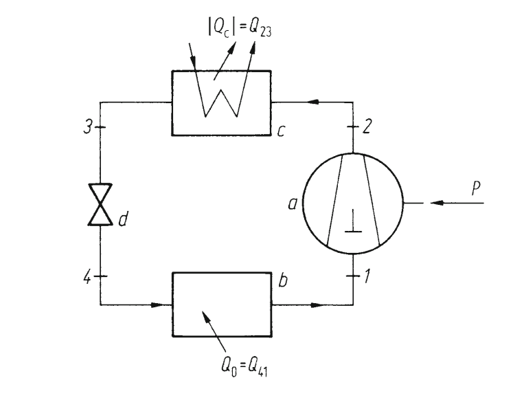

<!-- omit in toc -->
# Demomodell 
<!-- omit in toc -->
# Table of Contents 
- [Overview](#overview)
- [System Boundaries](#system-boundaries)
- [Components](#components)
  - [CHP Units](#chp-units)
  - [Heat Pump](#heat-pump)
  - [Battery Storage](#battery-storage)
  - [Heat Storage](#heat-storage)
  - [Local Heat Storage](#local-heat-storage)
  - [Photovoltaics](#photovoltaics)
  - [Collector (Solar Thermal)](#collector-solar-thermal)
  - [Grid](#grid)
- [Topology](#topology)
- [Ports](#ports)
  - [CHP](#chp)
    - [Input Ports](#input-ports)
    - [Output Ports](#output-ports)
  - [Heat Pump](#heat-pump-1)
    - [Stage 1](#stage-1)
      - [Input Ports](#input-ports-1)
      - [Output Ports](#output-ports-1)
    - [Stage 2](#stage-2)
      - [Input Ports](#input-ports-2)
      - [Output Ports](#output-ports-2)
  - [Storage](#storage)
    - [Battery Storage](#battery-storage-1)
      - [Input Ports](#input-ports-3)
      - [Output Ports](#output-ports-3)
    - [Heat Storage](#heat-storage-1)
      - [Input Ports](#input-ports-4)
      - [Output Ports](#output-ports-4)
    - [Local Heat Storage](#local-heat-storage-1)
      - [Input Ports](#input-ports-5)
      - [Output Ports](#output-ports-5)
  - [Photovoltaics](#photovoltaics-1)
    - [Output Ports](#output-ports-6)
  - [Collector](#collector)
    - [Output Ports](#output-ports-7)
  - [Grid](#grid-1)
    - [Electrical Grid](#electrical-grid)
      - [Input Ports](#input-ports-6)
      - [Output Ports](#output-ports-8)
    - [Hydrogen Grid](#hydrogen-grid)
      - [Output Ports](#output-ports-9)
    - [Heat Grid](#heat-grid)
      - [Input Ports](#input-ports-7)
      - [Output Ports](#output-ports-10)
    - [Waste Heat Grid](#waste-heat-grid)
      - [Input Ports](#input-ports-8)
      - [Output Ports](#output-ports-11)
    - [Local Heat Grid](#local-heat-grid)
      - [Input Ports](#input-ports-9)
      - [Output Ports](#output-ports-12)
- [Run the Script](#run-the-script)
  - [1. Install Dependencies](#1-install-dependencies)
  - [2. Select a Configuration File](#2-select-a-configuration-file)
  - [3. Run the Script](#3-run-the-script)
    - [Run with Default Configuration](#run-with-default-configuration)
    - [Run with a Specific Scenario](#run-with-a-specific-scenario)
  - [4. Execution Process](#4-execution-process)
  - [5. Naming Convention of the Results](#5-naming-convention-of-the-results)
    - [Output CSV Files](#output-csv-files)
    - [Metadata JSON Files](#metadata-json-files)

---

## Overview
This model demonstrates the optimization of an industrial energy system with focus on sector coupling between power and heat. 

It includes:
- Combined heat and power units (CHP)
- Heat Pumps
- Solar Thermal Collector
- Battery & Heat Storage
- Grid Connections (Power, Heat, Waste Heat)

---

## System Boundaries 

- Mixed-lineare programming approach (MILP)
- Perfect forecast
- Hourly resolution
- No transmission losses
- No ramp rates

---

## Components 

### CHP Units
- Two identical units (chp 1, chp 2)
- Fixed hydrogen admixture (0-100%)
- Assumptions:
  - Constant efficiency in converting fuel to both power and heat.
  - Linear dependency between:
    - gas consumption and power output
    - heat and power output
    - co2 and power output
    - waste heat and power output
  - Binary on/off modeling of operation.

  
### Heat Pump

**Technical specifications:**
- Working fluid: R-717 (Ammonia)
- Single-stage compression cycle
- Minimum temperature difference: 10 K
- No subcooling or desuperheating

*
*Figure 1: Schematic representation of the heat pump cycle with main components: compressor (a:1→2), condenser (c:2→3), expansion valve (d:3→4) and evaporator (b:4→1)**

**Thermodynamic assumptions:**

1. Isentropic compression
2. Isobaric heat rejection
3. Isothermal/isobaric heat rejection through condensation
4. Isenthalpic expansion through throttle valve
5. Isothermal/isobaric heat absorption in evaporator

**Additional Assumptions:**
- Single-stage compression
- No losses in compression, condensation, or expansion processes.

### Battery Storage

**Assumptions:**

- Perfect charging/discharging
- No losses
- No cyclic degradation
- Fixed capacity 

### Heat Storage 

**Assumptions:**

- Fixed storage capacity with ideal charge and discharge efficiency
- Negligible thermal losses during storage
- Only one-directional operation per time period (charge or discharge)

### Local Heat Storage
**Assumptions:**

- Fixed storage capacity with ideal charge and discharge efficiency.
- Instantaneous response during discharging
- bidirectional operation within the same timestep (charge and discharge)
- Negligible thermal losses during storage
- Ability to dispatch excess heat directly into district heating grid

### Photovoltaics
**Assumptions:**
- Constant panel efficiency (?) -> Martin fragen
- Ideal irradiance conditions without shading or degradation (?) -> Martin fragen
- Negligible conversion losses beyond rated efficiency (?) -> Martin fragen

### Collector (Solar Thermal)
**Assumptions:**
- Fixed Solar thermal capacity
- No ambient or thermal losses considered
- Constant collection efficiency over the operational period

### Grid 
**Assumptions:**
- No transmission losses between assets
- Unlimited flow capacity in network arcs
- Perfect balancing of supply and demand

---

## Topology

*
*Figure 2: Schematic Topology of the Demomodel**

---

**Arcs:**
*
*Figure 4: Schematic figure of an arc**

---
## Ports

**Ports:**
*
*Figure 3: Schematic figure of the of an asset**


### CHP

#### Input Ports
| Port Name      | Variable        | Description        | Unit  |
|---------------|-----------------|--------------------|-------|
| natural_gas_in | chp.natural_gas | Natural gas input  | MW    |
| hydrogen_in    | chp.hydrogen    | Hydrogen input     | MW    |

#### Output Ports
| Port Name      | Variable        | Description        | Unit  |
|---------------|-----------------|--------------------|-------|
| power_out      | chp.power       | Electrical power   | MW    |
| heat_out       | chp.heat        | Heat output        | MW    |
| waste_heat_out | chp.waste_heat  | Waste heat output  | MW    |

---

### Heat Pump

#### Stage 1

##### Input Ports
| Port Name      | Variable                 | Description                              | Unit  |
|----------------|--------------------------|------------------------------------------|-------|
| power_in       | heatpump_s1.power_in     | Electrical power input                   | MW    |
| waste_heat_in  | heatpump_s1.heat_in      | Waste heat input (from geo storage)      | MW    |

##### Output Ports
| Port Name      | Variable                | Description         | Unit  |
|----------------|-------------------------|---------------------|-------|
| heat_out       | heatpump_s1.heat_out    | Heat output         | MW    |

#### Stage 2

##### Input Ports
| Port Name      | Variable                   | Description                    | Unit  |
|----------------|----------------------------|--------------------------------|-------|
| power_in       | heatpump_s2.power_in       | Electrical power input         | MW    |
| waste_heat_in  | heatpump_s2.waste_heat_in   | Waste heat input               | MW    |

##### Output Ports
| Port Name      | Variable                | Description         | Unit  |
|----------------|-------------------------|---------------------|-------|
| heat_out       | heatpump_s2.heat_out    | Heat output         | MW    |

---

### Storage

#### Battery Storage

##### Input Ports
| Port Name      | Variable                         | Description       | Unit  |
|----------------|----------------------------------|-------------------|-------|
| power_in       | battery_storage.power_charging   | Charging power    | MW    |


##### Output Ports

| Port Name      | Variable                          | Description         | Unit  |
|----------------|-----------------------------------|---------------------|-------|
| power_out      | battery_storage.power_discharging | Discharging power   | MW    |


#### Heat Storage 

##### Input Ports
| Port Name      | Variable                      | Description       | Unit  |
|----------------|-------------------------------|-------------------|-------|
| heat_in        | heat_storage.heat_charging    | Charging heat     | MW    |

##### Output Ports
| Port Name      | Variable                      | Description         | Unit  |
|----------------|-------------------------------|---------------------|-------|
| heat_out       | heat_storage.heat_discharging | Discharging heat    | MW    |


#### Local Heat Storage 

##### Input Ports

| Port Name      | Variable                          | Description        | Unit  |
|----------------|-----------------------------------|--------------------|-------|
| heat_in        | local_heat_storage.heat_charging  | Charging heat      | MW    |


##### Output Ports

| Port Name       | Variable                               | Description                 | Unit  |
|-----------------|----------------------------------------|-----------------------------|-------|
| heat_out        | local_heat_storage.heat_discharging    | Discharging heat            | MW    |
| excess_heat_out | local_heat_storage.excess_heat_discharging | Excess heat discharging | MW    |

---

### Photovoltaics

#### Output Ports

| Port Name      | Variable  | Description       | Unit  |
|----------------|-----------|-------------------|-------|
| power_out      | pv.power  | Electrical power  | MW    |

---

### Collector 

#### Output Ports
| Port Name      | Variable          | Description  | Unit  |
|----------------|-------------------|--------------|-------|
| heat_out       | solar_thermal.heat | Heat output | MW    |

---
### Grid

#### Electrical Grid 

##### Input Ports

| Port Name      | Variable                     | Description            | Unit  |
|----------------|------------------------------|------------------------|-------|
| power_in       | electrical_grid.power_in     | Power feed-in          | MW    |

##### Output Ports

| Port Name      | Variable                      | Description           | Unit  |
|----------------|-------------------------------|-----------------------|-------|
| power_out      | electrical_grid.power_out      | Power supply         | MW    |

---

#### Hydrogen Grid


##### Output Ports

| Port Name     | Variable                      | Description         | Unit  |
|---------------|-------------------------------|---------------------|-------|
| hydrogen_out  | hydrogen_grid.hydrogen_out     | Hydrogen supply     | MW    |

---

#### Heat Grid 

##### Input Ports

| Port Name       | Variable                   | Description         | Unit  |
|-----------------|----------------------------|---------------------|-------|
| heat_in         | heat_grid.heat_in          | Heat feed-in        | MW    |
| excess_heat_in  | heat_grid.excess_heat_in   | Excess heat feed-in | MW    |

##### Output Ports

| Port Name               | Variable                       | Description                      | Unit  |
|-------------------------|--------------------------------|----------------------------------|-------|
| heat_out                | heat_grid.heat_out              | Heat supply                      | MW    |
| heat_grid_to_local_out  | heat_grid.heat_grid_to_local    | Heat grid to local heat grid     | MW    |

---

#### Waste Heat Grid 

##### Input Ports
| Port Name      | Variable                           | Description          | Unit  |
|----------------|------------------------------------|----------------------|-------|
| waste_heat_in  | waste_heat_grid.waste_heat_in       | Waste heat feed-in   | MW    |

##### Output Ports
| Port Name      | Variable                         | Description          | Unit  |
|----------------|----------------------------------|----------------------|-------|
| heat_out       | waste_heat_grid.waste_heat_out      | Waste heat supply   | MW    |

---

#### Local Heat Grid

##### Input Ports
| Port Name         | Variable                      | Description                  | Unit  |
|-------------------|-------------------------------|------------------------------|-------|
| heat_in           | local_heat_grid.heat_in        | Local heat feed-in           | MW    |
| district_heat_in  | local_heat_grid.district_heat_in | District heat feed-in      | MW    |

##### Output Ports
| Port Name      | Variable                         | Description          | Unit  |
|----------------|----------------------------------|----------------------|-------|
| heat_out       | local_heat_grid.heat_out          | Local heat supply    | MW    |


---

## Run the Script

### 1. Install Dependencies
Ensure all required dependencies are installed:

```bash
# Install dependencies
pip install -r requirements.txt
```

---

### 2. Select a Configuration File
Available configuration files are located in **`data/config/`**:

**Default Configuration:**
- `dummy.json`

**Scenario Configurations:**
- `gee23_ST-min_NW-ref_2028.json`
- `gee23_ST-max_NW-ref_2028.json`
- `gee23_ST-min_NW-ext_2028.json`
- `gee23_ST-max_NW-ext_2028.json`

Detailed descriptions of each scenario are available in `data/config/config-README.md`.

---

### 3. Run the Script

#### Run with Default Configuration
```bash
python main.py
```

#### Run with a Specific Scenario
```bash
python main.py --config gee23_ST-min_NW-ref_2028.json
```

---

### 4. Execution Process
During execution, the following steps occur:
- Solver options are set
- Input data is loaded
- The optimization model is instantiated and solved
- Results are stored in `data/output/`
- A solver log and metadata (`.json`) are also created

---

### 5. Naming Convention of the Results

The output files follow a consistent naming pattern that includes the configuration name and timestamp:

#### Output CSV Files

```bash
{config_name}_{timestamp}_output.csv
```

**Example:** `gee23_ST-min_NW-ref_2028_20240225_143022_output.csv`

- `config_name`: Name of the configuration file used (without `.json` extension)
- `timestamp`: Date and time of execution (`YYYYMMDD_HHMMSS` format)
- `output.csv`: Contains all timestep results including:
  - Parameters (power_price, gas_price, etc.)
  - Variables (power flows, storage levels, etc.)
  - Expressions (calculated values)

#### Metadata JSON Files  

```bash
{config_name}_{timestamp}_metadata.json
```

**Example:** `gee23_ST-min_NW-ref_2028_20240225_143022_metadata.json`

The metadata file contains:
- Timestamp of execution
- Configuration file used
- Solver options
- Component parameters (e.g., hydrogen admixture ratios)
- Other relevant run information

Both files are stored in the corresponding scenario subdirectory under `data/output/`.
