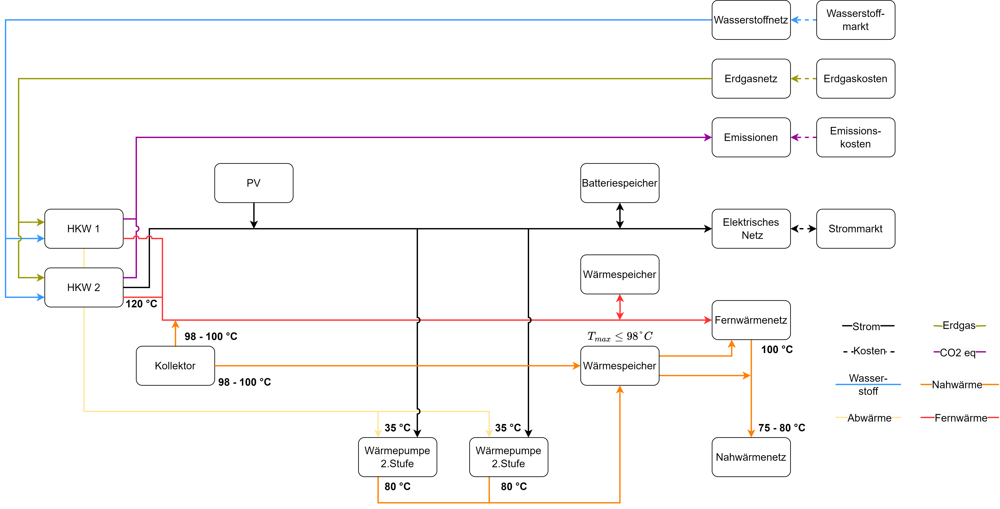

<!-- omit in toc -->
# Demomodell 
<!-- omit in toc -->
# Table of Contents 
- [Overview](#overview)
- [System Boundaries](#system-boundaries)
- [Components](#components)
  - [CHP Units](#chp-units)
  - [Heat Pump](#heat-pump)
  - [Energy Storage Systems](#energy-storage-systems)
- [Topology](#topology)
- [Ports](#ports)
  - [Ports of each Asset](#ports-of-each-asset)
    - [CHP: Input Ports](#chp-input-ports)
    - [CHP: Output Ports](#chp-output-ports)
    - [Heat Pump: Input Ports](#heat-pump-input-ports)
    - [Heat Pump: Output Ports](#heat-pump-output-ports)
    - [Battery Storage: Input Ports](#battery-storage-input-ports)
    - [Battery Storage: Output Ports](#battery-storage-output-ports)
    - [Heat Storage: Input Ports](#heat-storage-input-ports)
    - [Heat Storage: Output Ports](#heat-storage-output-ports)
    - [Local Heat Storage: Input Ports](#local-heat-storage-input-ports)
    - [Local Heat Storage: Output Ports](#local-heat-storage-output-ports)
    - [Photovoltaics: Output Ports](#photovoltaics-output-ports)
    - [Collector: Output Ports](#collector-output-ports)
    - [Electrical Grid: Input Ports](#electrical-grid-input-ports)
    - [Electrical Grid: Output Ports](#electrical-grid-output-ports)
    - [Hydrogen Grid: Input Ports](#hydrogen-grid-input-ports)
    - [Hydrogen Grid: Output Ports](#hydrogen-grid-output-ports)
    - [Heat Grid: Input Ports](#heat-grid-input-ports)
    - [Heat Grid: Output Ports](#heat-grid-output-ports)
    - [Waste Heat Grid: Input Ports](#waste-heat-grid-input-ports)
    - [Waste Heat Grid: Output Ports](#waste-heat-grid-output-ports)
    - [Local Heat Grid: Input Ports](#local-heat-grid-input-ports)
    - [Local Heat Grid: Output Ports](#local-heat-grid-output-ports)

---

## Overview
This model demonstrates the optimization of an industrial energy system with focus on sector coupling between power and heat. 

It includes:
- Combined heat and power units (CHP)
- Heat Pumps
- Solar Thermal Collector
- Battery & Heat Storage
- Grid Connections (Power, Heat, Waste Heat)

---

## System Boundaries 

- Mixed-lineare programming approach (MILP)
- Perfect forecast
- Hourly resolution
- No transmission losses
- No ramp rates 

---

## Components 

### CHP Units
- Two identical units
- Fixed hydrogen admixture (0-100%)
  
### Heat Pump

**Technical specifications:**
- Working fluid: R-717 (Ammonia)
- Single-stage compression cycle
- Minimum temperature difference: 10 K
- No subcooling or desuperheating

*
*Figure 1: Schematic representation of the heat pump cycle with main components: compressor (a:1→2), condenser (c:2→3), expansion valve (d:3→4) and evaporator (b:4→1)**

**Thermodynamic assumptions:**

1. Isentropic compression
2. Isobaric heat rejection
3. Isothermal/isobaric heat rejection through condensation
4. Isenthalpic expansion through throttle valve
5. Isothermal/isobaric heat absorption in evaporator

### Energy Storage Systems

**Assumptions:**

- Perfect charging/discharging
- No losses
- No cyclic degradation

---

## Topology

*
*Figure 2: Schematic Topology of the Demomodel**

---

**Arcs:**
*
*Figure 4: Schematic figure of an arc**

---
## Ports

**Ports:**
*
*Figure 3: Schematic figure of the of an asset**

### Ports of each Asset

#### CHP: Input Ports
| Port Name      | Variable        | Description        | Unit  |
|---------------|-----------------|-------------------|-------|
| natural_gas_in | chp.natural_gas | Natural gas input  | MW    |
| hydrogen_in    | chp.hydrogen    | Hydrogen input     | MW    |

#### CHP: Output Ports
| Port Name      | Variable        | Description        | Unit  |
|---------------|-----------------|-------------------|-------|
| power_out      | chp.power      | Electrical power   | MW    |
| heat_out       | chp.heat       | Heat output       | MW    |
| waste_heat_out | chp.waste_heat | Waste heat output | MW    |

---

#### Heat Pump: Input Ports
| Port Name      | Variable        | Description        | Unit  |
|---------------|-----------------|-------------------|-------|
| power_in       | heatpump.power  | Electrical power   | MW    |
| waste_heat_in  | heatpump.heat_input | Waste heat input | MW    |

#### Heat Pump: Output Ports
| Port Name      | Variable        | Description        | Unit  |
|---------------|-----------------|-------------------|-------|
| heat_out       | heatpump.heat   | Heat output        | MW    |

---

#### Battery Storage: Input Ports
| Port Name      | Variable        | Description        | Unit  |
|---------------|-----------------|-------------------|-------|
| power_in       | battery_storage.power_charging | Charging power | MW    |

#### Battery Storage: Output Ports
| Port Name      | Variable        | Description        | Unit  |
|---------------|-----------------|-------------------|-------|
| power_out      | battery_storage.power_discharging | Discharging power | MW    |

---

#### Heat Storage: Input Ports
| Port Name      | Variable        | Description        | Unit  |
|---------------|-----------------|-------------------|-------|
| heat_in        | heat_storage.heat_charging | Charging heat | MW    |

#### Heat Storage: Output Ports
| Port Name      | Variable        | Description        | Unit  |
|---------------|-----------------|-------------------|-------|
| heat_out       | heat_storage.heat_discharging | Discharging heat | MW    |

---

#### Local Heat Storage: Input Ports
| Port Name      | Variable        | Description        | Unit  |
|---------------|-----------------|-------------------|-------|
| heat_in        | local_heat_storage.heat_charging | Charging heat | MW    |

#### Local Heat Storage: Output Ports
| Port Name      | Variable        | Description        | Unit  |
|---------------|-----------------|-------------------|-------|
| heat_out       | local_heat_storage.heat_discharging | Discharging heat | MW    |
| excess_heat_out| local_heat_storage.excess_heat_discharging | Excess heat discharging | MW    |

---

#### Photovoltaics: Output Ports
| Port Name      | Variable        | Description        | Unit  |
|---------------|-----------------|-------------------|-------|
| power_out      | pv.power        | Electrical power   | MW    |

---

#### Collector: Output Ports
| Port Name      | Variable        | Description        | Unit  |
|---------------|-----------------|-------------------|-------|
| heat_out       | solar_thermal.heat | Heat output    | MW    |

---

#### Electrical Grid: Input Ports
| Port Name      | Variable        | Description        | Unit  |
|---------------|-----------------|-------------------|-------|
| power_in       | electrical_grid.power_feedin | Power feed-in | MW    |

#### Electrical Grid: Output Ports
| Port Name      | Variable        | Description        | Unit  |
|---------------|-----------------|-------------------|-------|
| power_out      | electrical_grid.power_supply | Power supply | MW    |

---

#### Hydrogen Grid: Input Ports
| Port Name      | Variable        | Description        | Unit  |
|---------------|-----------------|-------------------|-------|
| hydrogen_in    | hydrogen_grid.hydrogen_feedin | Hydrogen feed-in | MW    |

#### Hydrogen Grid: Output Ports
| Port Name      | Variable        | Description        | Unit  |
|---------------|-----------------|-------------------|-------|
| hydrogen_out   | hydrogen_grid.hydrogen_supply | Hydrogen supply | MW    |

---

#### Heat Grid: Input Ports
| Port Name      | Variable        | Description        | Unit  |
|---------------|-----------------|-------------------|-------|
| heat_in        | heat_grid.heat_feedin | Heat feed-in | MW    |
| excess_heat_in | heat_grid.excess_heat_feedin | Excess heat feed-in | MW    |

#### Heat Grid: Output Ports
| Port Name      | Variable        | Description        | Unit  |
|---------------|-----------------|-------------------|-------|
| heat_out       | heat_grid.heat_supply | Heat supply | MW    |
| heat_grid_to_local_out | heat_grid.heat_grid_to_local | Heat grid to local heat grid | MW    |

---

#### Waste Heat Grid: Input Ports
| Port Name      | Variable        | Description        | Unit  |
|---------------|-----------------|-------------------|-------|
| waste_heat_in  | waste_heat_grid.heat_feedin | Waste heat feed-in | MW    |

#### Waste Heat Grid: Output Ports
| Port Name      | Variable        | Description        | Unit  |
|---------------|-----------------|-------------------|-------|
| heat_out       | waste_heat_grid.heat_supply | Waste heat supply | MW    |

---

#### Local Heat Grid: Input Ports
| Port Name      | Variable        | Description        | Unit  |
|---------------|-----------------|-------------------|-------|
| heat_in        | local_heat_grid.heat_feedin | Local heat feed-in | MW    |
| district_heat_in | local_heat_grid.district_heat_feedin | District heat feed-in | MW    |

#### Local Heat Grid: Output Ports
| Port Name      | Variable        | Description        | Unit  |
|---------------|-----------------|-------------------|-------|
| heat_out       | local_heat_grid.heat_supply | Local heat supply | MW    |