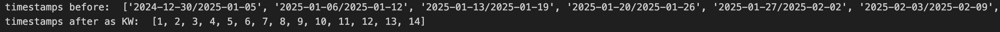
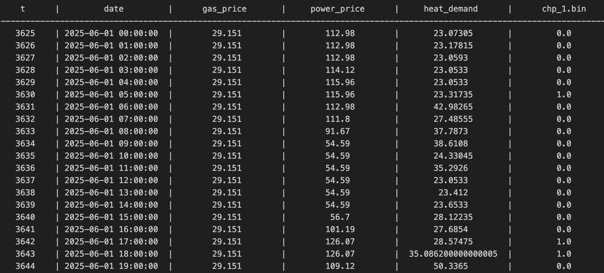
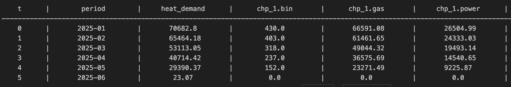
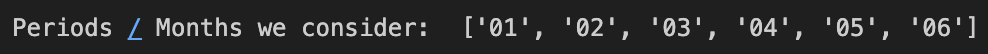
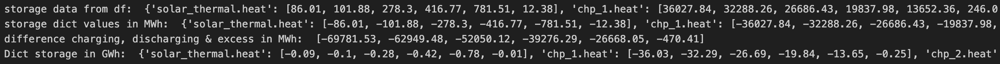
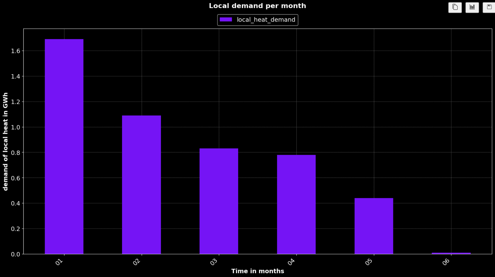
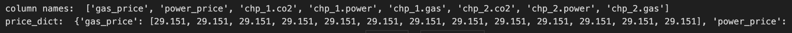
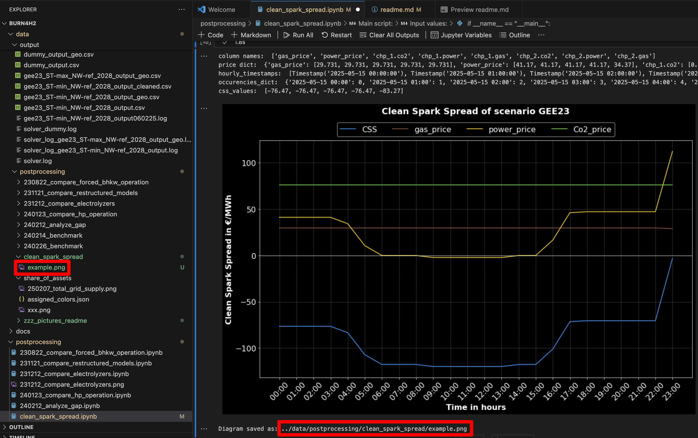

# Burn4H2 Module: Postprocessing
# Table of Contents
- [1 General information](#1-general-information)
- [2 Installation](#2-installation)
- [3 share_of_assets.ipynb](#3-share_of_assets.ipynb)
    - [3.1 What is it for?](#3.1-what-is-it-for?)
    - [3.2 Structure](#3.2-Structure)
    - [3.3 Import of packages](#3.3-Import-of-packages)
    - [3.4 General Helpers](#3.4-General-Helpers)
    - [3.5 Helpers for Colormaps](#3.5-Helpers-for-Colormaps)
    - [3.6 Load data from csv output](#3.6-Load-data-from-csv-output)
    - [3.7 Functions for filtering and calculating values for set time granularity](#3.7-Functions-for-filtering-and-calculating-values-for-set-time-granularity)
    - [3.8 Functions for setting assets and parameters to be visualized](#3.8-Functions-for-setting-assets-and-parameters-to-be-visualized)
    - [3.09 Functions for simple plotting of supply (stacked) and demand](#3.9-Functions-for-simple-plotting-of-supply-(stacked)-and-demand)
    - [3.10 Functions for plotting storage values (fusion or single output)](#Functions-for-plotting-storage-values-(fusion-or-single-output))
    - [3.11 Compare two data sets from csv in one plot](#3.11-Compare-two-data-sets-from-csv-in-one-plot)
    - [3.12 Function for saving plots of any kind.](#3.12-Function-for-saving-plots-of-any-kind.)
    - [3.13 Wrapper for Main function - Decide for plot with input value](#3.13-Wrapper-for-Main-function-–-Decide-for-plot-with-input-value)
    - [3.14 Main script for generating results – need to be executed!](#3.14-Main-script-for-generating-results-–-need-to-be-executed!)
- [4 clean_spark_spread.ipynb](#4-clean_spark_spread.ipynb)  
    - [4.1 What is it for?](#4.1-What-is-it-for?)
    - [4.2 Structure](#4.2-Structure)
    - [4.3 Import of packages](#4.3-Import-of-packages)  
    - [4.4 General Helpers](#4.4-General-Helpers)
    - [4.5 Load data from csv output](#4.5-Load-data-from-csv-output)
    - [4.6 Functions for filtering and extracting values](#4.6-Functions-for-filtering-and-extracting-values)  
    - [4.7 Calculate CSS](#4.7-Calculate-CSS)
    - [4.8 Plot economic data](#4.8-Plot-economic-data)
    - [4.9 Main Script](#4.9-Main-Script)


## 1 General information: 
Postprocessing is a folder with scripts that process data from folder output. 
It is coded in jupyter notebook. Typically it generates diagrams and plots for visualization results of linear optimization. 
The following document explains the structure, script functions and what users need to know and keep in mind to use the script. 
Detailed input and output information are documented in docstrings of functions. 

## 2 Installation
Apart from standard installations like a python interpreter and jupyter notebook please check in each script the section "Import of packages" for list of necessary libraries. 

## 3 share_of_assets.ipynb
### 3.1 What is it for?
This script processes data from output csv-data with results from modeling. 
Focus lies on generating stacked box plots, that show demand and supply of different assets, storages for a given time period (f. e. in summer) and granularity (weeks, months etc.). It is possible to add a tag in plot that shows the percentage of an asset or a group of assets on total supply.

### 3.2 Structure
- Import of packages
- General Helpers
- Helpers for Colormaps
- Load data from csv output
- Functions for filtering and calculating values for set time granularity
- Functions for setting assets and parameters to be visualized
- Functions for plotting and saving bar chart for share of assets
- Main Script

### 3.3 Import of packages
Code needs to be executed to load necessary libraries:
- pandas
- numpy
- matplotlib.pyplot 
- Normalize, ListedColormap, LinearSegmentedColormap
- colorcet
- os
- datetime
- json
- Image

#### Code Example:
````python
import pandas as pd
import numpy as np
import matplotlib.pyplot as plt 
from matplotlib.colors import ListedColormap, LinearSegmentedColormap
import colorcet as cc
import os
from datetime import datetime
import json
from PIL import Image
````

### 3.4 General Helpers
**functions**: 
- print_df
- change_energy_units
- get_months_from_timestamp
- get_weeks_from_timestamp
- get_days_from_timestamp
- get_hours_from_timestamp

General Helpers can be used all the time and may be **outsourced soon into a separate file** for easy access from anywhere in postprocessing.

**print_df**:  
Function helps printing DataFrames in an appropriate format for console output. It's usable for any DataFrame.

#### Output example:


**change_energy_units**:  
If you input a list and the actual and target unit you want the data to appear you get a list as a return value with adjusted values in your target unit. It is at the moment just usable for: MWh, GWh, kWh and MW, GW, kW. Other units need to be added. If another unit is given you get a key error message, that the given unit is not fitting function. Values in lists are usually of type float. 

#### Output example:


**get_months_from_timestamp**:  
If a list of timestamps with months in this format is given ['YYYY-MM', ...], the function cuts off the string of the year, so just the month-date is left. The list of months is given back as return value. 

#### Output example:


**get_weeks_from_timestamp**:  
If a list of timestamps with start and enddates of weeks is given with the format "['YYYY-MM-DD/YYYY-MM-DD', ...]" the function takes the start date of the week and looks for fitting KW for plotting. It gives back the list with KWs.

#### Output example:


**get_days_from_timestamp**: 
If a list of timestamps with months in this format is given ['YYYY-MM-DD', ...], the function cuts off the string of the year, so just the days and months are left. The list of days is given back as return value. 

#### Output example: 


**get_hours_from_timestamp**: 
If a list of timestamps in this format is given ['YYYY-MM-DD HH:MM', ...], the function cuts of the string of the year, so just the days, months and hours are left. The list of hours is given back as return value. 

#### Output example: 


### 3.5 Helpers for Colormaps
**functions**:
- register_colormap
- shift_colormap
- darken_colormap
- get_color_for_key
- load_color_data_from_json
- save_colors_for_key_json
- show_color_rgba

In this section general functions for showing, adjusting, loading and saving colors and colormaps of plots are explained.

**register_colormap**:  
Sometimes colormaps are from another library or created by ourselves, so they are not listed in matplotlib. In this case they need to be registered if we want to process them as usual with plt commands. Therefore the function registers colormaps in plt from another library called "colorcet". Other libraries are at the moment not included. The function checks if the colorcet is registered in plt. If not it loads it from plt or registers it for cc. Afterwards the colormap can be used as any other plt colormap by name.

**shift_colormap**:  
Sometimes just special parts of a colormap are interesting for visualization. Especially black and white are colors that are not always requested. Therefore this function allows to shift the color spectrum to parts that are interesting. To shift a colormap we need to set a start and end parameter. Parameters need to be set between 0 and 1. Default values are start: 0 and end: 1. See the example below: 

#### Code example:
```python
import numpy as np
import matplotlib.pyplot as plt
import matplotlib.colors as mcolors
from matplotlib.colors import LinearSegmentedColormap

def register_colormap(cmap_name: str):
    """load colormap from plt and register in plt if colormap from cc.

    Args:
        cmap_name (str): colormap name as string registered in plt or cc.

    Returns:
       LinearSegmentedColormap : loaded colormap from plt.
    """
    if cmap_name not in plt.colormaps():
        colormap = cc.cm[cmap_name]  # load colormap from colorcet
        plt.register_cmap(name=cmap_name, cmap=ListedColormap(colormap(np.linspace(0, 1, 256))))  # only if not available register colormap
    else:
        colormap = plt.get_cmap(cmap_name) # if already registered in matplotlib load map from there.
    return colormap

def shift_colormap(cmap_name: str, start=0.0, end=1.0, amount_colors=256):
    """
    Returns a new colormap that contains a partial area of the original colormap.
    """
    colormap = register_colormap(cmap_name)
    return LinearSegmentedColormap.from_list(
        f"{cmap_name}_adjusted", colormap(np.linspace(start, end, amount_colors))
    )

# Define input data
cmap_name = "viridis"
start, end = 0.2, 0.8  # Shift colormap to focus on a subset
amount_colors = 256

# Generate original and modified colormaps
original_cmap = register_colormap(cmap_name)
modified_cmap = shift_colormap(cmap_name, start, end, amount_colors)

# Generate sample data for visualization
data = np.linspace(0, 1, 100).reshape(10, 10)

# Plot original and shifted colormaps
fig, axes = plt.subplots(1, 2, figsize=(10, 4))

# Original colormap
cbar_original = axes[0].imshow(data, cmap=original_cmap)
axes[0].set_title(f"Original {cmap_name} Colormap")
fig.colorbar(cbar_original, ax=axes[0])

# Shifted colormap
cbar_modified = axes[1].imshow(data, cmap=modified_cmap)
axes[1].set_title(f"Shifted {cmap_name} Colormap ({start} to {end})")
fig.colorbar(cbar_modified, ax=axes[1])

plt.show()
```

#### Output example:


**important: This function is not used in main due to other color demands!**

**darken_colormap**:  
Sometimes it can make sense to show references between different plots or you just want to make colors from a suiting colormap brighter oder darker. In this case it can be an idea to use same colormaps but change the brightness of these colors. In this case this function is designed to darken a given colormap. See the example below: 

#### Code example:
```python
def register_colormap(cmap_name: str):
    """load colormap from plt and register in plt if colormap from cc.

    Args:
        cmap_name (str): colormap name as string registered in plt or cc.

    Returns:
       LinearSegmentedColormap : loaded colormap from plt.
    """
    if cmap_name not in plt.colormaps():
        colormap = cc.cm[cmap_name]  # load colormap from colorcet
        plt.register_cmap(name=cmap_name, cmap=ListedColormap(colormap(np.linspace(0, 1, 256))))  # only if not available register colormap
    else:
        colormap = plt.get_cmap(cmap_name) # if already registered in matplotlib load map from there.
    return colormap

def darken_colormap(cmap_name: str, factor: float, spectrum_left=0.0, spectrum_right=1.0, amount_colors=256):
    """
    Darkens the color map by scaling the RGB values.
    """
    colormap = register_colormap(cmap_name)
    colors = colormap(np.linspace(spectrum_left, spectrum_right, amount_colors))  # Create a list of colors
    darkened_colors = colors.copy()  # Create a copy of the colors
    darkened_colors[:, :3] *= factor  # Only scale RGB values, alpha remains the same
    return LinearSegmentedColormap.from_list(f"{cmap_name}_darkened", darkened_colors)

# Define input data
cmap_name = "viridis"
factor = 0.5  # Darken by 50%
spectrum_left, spectrum_right = 0.0, 1.0
amount_colors = 256

# Generate original and modified colormaps
original_cmap = register_colormap(cmap_name)
darkened_cmap = darken_colormap(cmap_name, factor, spectrum_left, spectrum_right, amount_colors)

# Generate sample data for visualization
data = np.linspace(0, 1, 100).reshape(10, 10)

# Plot original and darkened colormaps
fig, axes = plt.subplots(1, 2, figsize=(10, 4))

# Original colormap
cbar_original = axes[0].imshow(data, cmap=original_cmap)
axes[0].set_title(f"Original {cmap_name} Colormap")
fig.colorbar(cbar_original, ax=axes[0])

# Darkened colormap
cbar_darkened = axes[1].imshow(data, cmap=darkened_cmap)
axes[1].set_title(f"Darkened {cmap_name} Colormap (Factor: {factor})")
fig.colorbar(cbar_darkened, ax=axes[1])

plt.show()
```

#### Output example:


**important: This function is not used in main due to other color demands!**

**get_color_for_key**:  
Sometimes it's senseful to link a color to a key (in this case asset). Colors are saved in assigend_colors_dict and can be saved in a json file to garantuee a color assignment over several executings of the script (function: save_colors_for_key_json). In this function a colormap and belonging parameters are given and as well as an asset name as a string. We want to give this asset a color and skip with the next asset to the next color and assign it. Look at the example below:  

#### Code example:
````python
def get_color_for_key(
    asset_name: str, 
    cmap_name:str, 
    assigned_colors:dict,
    spectrum_left = 0.0,
    spectrum_right = 1.0,
    amount_colors = 256
    ):
    """Assign colors for assets and save in dictionary with assigned_colors.

    Args:
        asset_name (str): String of asset name.
        cmap_name (str): colormap from which assets get colors assigned to
        assigned_colors (dict): existing color dictionary (can also be empty at the beginning)
        spectrum_left(float): starting point of colormap (0.0 = left, 1.0 = right). Defaults to 0.
        spectrum_right (float): end point of colormap (0.0 = left, 1.0 = right). Defaults to 1.
        amount_colors (int): Amounts of colors extracted from map. Defaults to 256.

    Returns:
        tuple: color tuple for one asset with color values in rgba data (values between 0 and 1).
    """
    colormap = register_colormap(cmap_name=cmap_name)
    colors = colormap(np.linspace(spectrum_left, spectrum_right, amount_colors))
    asset_name_split = asset_name.split(".")[0]
    if asset_name_split not in assigned_colors:
        # If key does not have a color, give it the next one: 
        next_color = len(assigned_colors) % len(colors)  # cyclic iterating through colormap
        assigned_colors[asset_name_split] = colors[next_color]
        print(f"neue farbe für: {asset_name_split}:", colors[next_color])
    return tuple(assigned_colors[asset_name_split])

# Define test data
cmap_name = "tab10"
assets = ["solar_panel", "wind_turbine", "battery_storage", "hydro_power", "geothermal"]
assigned_colors = {}

# Assign colors by calling the function multiple times with unique indices
for i, asset in enumerate(assets):
    get_color_for_key(asset, cmap_name, assigned_colors, spectrum_left=i/len(assets), spectrum_right=(i+1)/len(assets))

# Plot assigned colors
fig, ax = plt.subplots(figsize=(6, 3))
for i, (asset, color) in enumerate(assigned_colors.items()):
    ax.barh(i, 1, color=color)
ax.set_title("Assigned Colors for Assets")
ax.set_xticks([])
ax.set_yticks(range(len(assigned_colors)))
ax.set_yticklabels(assigned_colors.keys())
plt.show()
````
#### Output example:


**load_color_data_from_json**:  
For postprocessing it can be helpful if recurring assets retain a color for more than one execution of script f. e. if more than one diagram is generated with different input variables. In this case it makes sense to save colordata in a json file and load it every time the script is executed. This function is for loading a json file into a dictionary with the key of an asset and their colordata in rgba format. See the example below:

#### Code example:
````python
def load_color_data_from_json(
    colors_file: str, 
    output_path: str
    ):
    """
    Loads color values for assets from a JSON file. If the file does not exist
    or is invalid, an empty dictionary is returned.

    Args:
        colors_file (str): name of JSON-file.
        output_path (str): path of saving output file.

    Returns:
        Tuple[dict, str]: Dictionary with the color assignments and file path.
    """
    input_file = os.path.join(output_path, colors_file)
    
    if os.path.exists(input_file):
        try:
            with open(input_file, "r") as file:
                assigned_colors = json.load(file)
            
            # Convert lists back into tuples
            assigned_colors = {key: tuple(value) for key, value in assigned_colors.items()}
        except (json.JSONDecodeError, ValueError):  # Intercept errors during loading
            print(f"Warnung: {input_file} ist beschädigt oder ungültig. Erstelle ein leeres Dictionary.")
            assigned_colors = {}
    else:
        print(f"Datei {input_file} existiert nicht. Erstelle ein neues Dictionary.")
        assigned_colors = {}

    return assigned_colors, input_file

# Example execution
OUTPUT_PATH = '../data/postprocessing/share_of_assets'
COLORS_FILE = 'assigned_colors.json'

# Load color data
assigned_colors, file_path = load_color_data_from_json(COLORS_FILE, OUTPUT_PATH)

# Print results
print("Geladene Farben:", assigned_colors)
print("Pfad zur Datei:", file_path)
````

#### Output example:


**save_colors_for_key_json**:  
To keep colors for known and already displayed assets their color data needs to be saved to load it for next execution of script. If a new color for an asset was set during execution because the asset was not considered before, this colordata is going to be added to origin json file. Therefore this file just gets added and never delets any entries. Once set data for assets are fixed. If a color of a special asset is supposed to be changed the file needs to be deleted or manually edited.

#### Code example: 
- Color dict is loaded in function: "load_color_data_from_json" (see above)
- Color dict is added with new color if new asset is not considered in color dict in function: "get_color_for_key" with this line:  
````python
if asset_name_split not in assigned_colors:
        # If key does not have a color, give it the next one: 
        next_color = len(assigned_colors) % len(colors)  # cyclic iterating through colormap
        assigned_colors[asset_name_split] = colors[next_color]
````
This function gives back the dictionary in main, so it can be saved with updated values in json-file with the following function "save_colors_for_key_json":  
````python
def save_colors_for_key_json(
    colors_file: str, 
    assigned_colors: dict
    ):
    """
    Saves the dictionary with the color assignments in a JSON file.

    Args:
        colors_file (str): path of JSON-file.
        assigned_colors (dict): Dictionary with color assignments.
    """
    # convert NumPy-Arrays in lists
    serializable_colors = {key: value.tolist() if isinstance(value, np.ndarray) else value
                           for key, value in assigned_colors.items()}
    
    # save JSON file
    with open(colors_file, "w") as file:
        json.dump(serializable_colors, file, indent=4)
        
    print(f"JSON file saved as: {colors_file}")

# executed function in main:
save_colors_for_key_json(
    colors_file=color_file_json, 
    assigned_colors=colors_dict
    )
````
#### Output example:  
As an output we get a note, that the file is updated and saved in a given path:


**show_color_rgba**:  
If you assign a special color to an asset or just want to know which color an asset has got you can visualize the color with the function "show_color_rgba". It works for the colorformat rgba in a tuple with floats between 0 and 1. A popup window appears with the color you wanted to visualize. See the example below: 

#### Code example: 
````python 
def show_color_rgba(
    rgba_values:tuple
    ):
    """Show a color in form of rgba with values between 0 and 1.

    Args:
        rgba_values (tuple): 4 values of rgba between 0 and 1.
    """
    rgba_color_255 = tuple(int(color * 255) for color in rgba_values)
    image = Image.new("RGBA", (100, 100), rgba_color_255)
    image.show()

# Example execution
example_rgba = (0.2, 0.6, 0.8, 1.0)  # A blueish color
show_color_rgba(example_rgba)
````
#### Output example:  


### 3.6 Load data from csv output:  
All postprocessing scripts refer to results from optimization model. In this case, they refer to the old file output_time_series.csv. In this case the function loads data from this csv to a processable df, that's easy to read. Newer filenames are f. e. modeled scenarios like gee23_ST-min_NW-ref_2028_output.csv. In this case we look at the old file as there is no difference. See example below: 

#### Code example: 
````python
# 0.3 Load DataFrame of CSV as input-data: 
def load_csv_results_in_df(
    input_path: str
    ):
    """Load output csv in dataframe.

    Args:
        input_path (str): path from which csv is loaded. 

    Returns:
        pd.DataFrame: csv data in dataframe as table type.
    """
    
    input_values_df = pd.read_csv(input_path, index_col=0)
    print_df(input_values_df)
    
    return input_values_df

# Example execution:
INPUT_PATH = "../data/output/output_time_series.csv"
df = load_csv_results_in_df(input_path=INPUT_PATH)
````

#### Output example: 


### 3.7 Functions for filtering and calculating values for set time granularity

**functions**:  
- add_timestamp_and_filter
- sums_by_granularity
- Wrapper: calculate_sums_for_period

In this section input data from result csv is connected, filtered and summed up for time values. It is necessary to show box plots for a specific period.

**add_timestamp_and_filter**:  
All data from output_time_series.csv is given hourly for 1 year (366 days), which ends up in 8784 values. These values are not linked to datetime. In this function data is linked to datetime like "YYYY-MM-DD hh:mm:ss" and inserted into df in column 0 to get a link to time. See the example below:

#### Code example: 
````python
def add_timestamp_and_filter(
    input_df = pd.DataFrame, 
    start_date = str, 
    end_date = str, 
    time_column = 'date'
    ):
    """Insert Dates (YYYY-MM-DD) in DataFrame and filter after given start and end date.
    Assumption: 8784 values (366 days) beginning at 01.01.2025. If necessary needs to be 
    flexibilized.

    Args:
        df (pd.DataFrame, optional): Input Dataframe from results. Defaults to pd.DataFrame.
        start_date (str, optional): first date for filtering. Defaults to str.
        end_date (str, optional): end date for filtering. It's always inkluded in time. Defaults to str.
        time_column (str, optional): name of column with time steps. Default value 'date'.

    Returns:
        pd.DataFrame: added colomn with dates and filtered Dataframe after time span.
    """
    # Create List of dates and hours belonging to timestep:
    dates = list(pd.date_range('2025-01-01', periods=8784, freq='H')) # 168 Werte in Demooutput! 
    input_df.insert(0, time_column, dates, allow_duplicates=False)
    input_df[time_column] = pd.to_datetime(input_df[time_column])
    
    # Delete blank spaces of colomn names:
    input_df.columns = input_df.columns.str.replace(' ', '')
    # print("Inserted date columns: /n", print_df(input_df)) # show assigned dates and hours
    
    # Ensure that end_date covers the entire last day:
    end_date = pd.Timestamp(end_date) + pd.Timedelta(days=1) - pd.Timedelta(seconds=1)

    # Filter the DataFrame based on the corrected time range:
    return input_df[
        (input_df[time_column] >= pd.Timestamp(start_date)) & 
        (input_df[time_column] <= end_date)
    ]

# Example execution
INPUT_PATH = "../data/output/output_time_series.csv"
df = load_csv_results_in_df(input_path=INPUT_PATH)
START_DATE = "2025-06-01"
END_DATE = "2025-06-10"
filtered_df = add_timestamp_and_filter(df, START_DATE, END_DATE)
print_df(filtered_df)
````

#### Output example: 
In first step dataframe is added by time with the date from 01.01.2025 per hour. 


Secondly data is filtered by the time range we're interested in plotting, in this case from 01.06. until 10.06. 


**sums_by_granularity**:  
After filtering for time we don't want data process hourly data for plots only. In this function we set a time granularity like days, weeks, months or years. In the function all columns from heat_demand are summed up for given time granularity (excluding fixed prices per unit). See example below:

*Note: It should be noted that some values does not make sense if they are summed up like "battery_storage.power_content" because contents don't sum up by time but are more like snap shots! If these columns are processed another function is needed to show this data.*

#### Code example: 
````python
def sums_by_granularity(
    input_df: pd.DataFrame, 
    granularity: str, 
    time_column = 'date',
    period_column = 'period'
    ):
    """group lines of dataframe to given granularity (years, months etc.) and 
    sum up values of columns beginning from second column.

    Args:
        input_df (pd.DataFrame, optional): Dataframe with existing time_column. Defaults to pd.DataFrame.
        granularity (str, optional): time granularity: hours, days, weeks, month, years. Defaults to str.
        time_column (str, optional): Name of column with time data. Default value 'date'.
        period_column (str, optional): Name of column with set period (month, weeks ...). Default value 'period'.

    Raises:
        ValueError: if another granularity is given than defined no groups can 
        be formed.

    Returns:
        pd.DataFrame: filtered DataFrame with relevant time span and granularity. Sums are calculated for time spans. 
    """
    
    df = input_df.copy()
    df[time_column] = pd.to_datetime(df[time_column])
    if granularity == 'month':
        df[period_column] = df[time_column].dt.to_period('M')
    elif granularity == 'year':
        df[period_column] = df[time_column].dt.to_period('Y')
    elif granularity == 'week':
        df[period_column] = df[time_column].dt.to_period('W')
    elif granularity == 'day':
        df[period_column] = df[time_column].dt.to_period('D')
    elif granularity == 'hour':
        df[period_column] = df[time_column].dt.to_period('H')
    else:
        raise ValueError("Invalid time granularity.")
    
    # calculate the totals from the 2nd column, index period is reset and round to 2 digits.
    time_sums_df = df.groupby(period_column).sum().iloc[:, 2:].reset_index().round(2) 
    time_sums_df[period_column] = time_sums_df[period_column].astype(str)  # convert periods to string format
    
    return time_sums_df

# get dataframe to process time granularity in: 
INPUT_PATH = "../data/output/output_time_series.csv"
df = load_csv_results_in_df(input_path=INPUT_PATH)
filtered_df = add_timestamp_and_filter(input_df=df, start_date="2025-01-01", end_date="2025-06-01")

# example execution: 
granularity = "month"
result_df = sums_by_granularity(input_df=filtered_df, granularity=granularity)
print_df(result_df)
````

#### Output example:


**Wrapper: calculate_sums_for_period**:  
Because we don't always need all interim results the wrapper function "calculate_sums_for_period" executes both functions "add_timestamp_and_filter" and "sums_by_granularity" and slims our main function. Therefore outputs and inputs are the same, see below: 

#### Code example: 
````python
def calculate_sums_for_period(
    input_df: pd.DataFrame, 
    start_date: str, 
    end_date: str, 
    granularity: str, 
    time_column='date',
    period_column='period'
    ):
    """Wrapper function: add and filter time values and sum up all values for time span and set granularity.

    Args:
        input_df (pd.DataFrame): Input Dataframe with all data from csv "output_time_series.csv"
        start_date (str): Start date for visualization. Format: 'YYYY-MM-DD'
        end_date (str): end date for visualization. Format: 'YYYY-MM-DD'
        granularity (str): granularity of time: "hours", "days", "weeks", "months", "years".
        time_column (str, optional): name of column with time data. Defaults to 'date'.
        period_column (str, optional): name of column with set period. Defaults to 'period'.

    Returns:
        pd.DataFrame: filtered dataframe after time and granularity and summed up data. 
    """
    time_filtered_df = add_timestamp_and_filter(
        input_df=input_df, 
        start_date=start_date, 
        end_date=end_date, 
        time_column=time_column
        )
    
    return sums_by_granularity(
        input_df=time_filtered_df, 
        granularity=granularity, 
        time_column=time_column, 
        period_column=period_column
        )

# example execution: 
INPUT_PATH = "../data/output/output_time_series.csv"
df = load_csv_results_in_df(input_path=INPUT_PATH)
result_df = calculate_sums_for_period(input_df=df, start_date="2025-01-01", end_date="2025-06-01", granularity="month")
print_df(result_df)
````

#### Output example: 


### 3.8 Functions for setting assets and parameters to be visualized
**functions**: 
- extract_assets_to_dict
- calculate_asset_share_of_supply
- get_periods_for_plot
- Wrapper: get_asset_data_for_plot
- get_data_for_storage_plot
- get_demand_for_plot

In this section we prepare our data for plotting especially summed up supply values. We're connecting our assets to a specific variable we're interested in, we can calculate a specific share of assets on a f.e. total supply and prepare our periods from section 1 for our plot.

**extract_assets_to_dict**:  
To show data from assets we're interested in, we need to extract all assets and their summed up energy value for the type of energy we want to plot. The following function links our set keys with variables from our filtered dataframe which bases on our output_time_series_csv. Therefore we need to define strings of assets and type_of_energy correctly based on those definitions in csv data columns. The function sets up a dictionary with our variables as keys and a belonging list of values for our set time span and granularity. See example below: 

#### Code example: 
````python
def extract_assets_to_dict(
    time_series_df: pd.DataFrame, 
    assets: tuple, 
    type_of_energy: str
    ):
    """
    Reads certain columns associated with all relevant assets for the diagram from a DataFrame 
    and saves them in a dictionary.

    Parameters:
        time_series_df (pd.DataFrame): DataFrame, with all asset data summed up for certain granularity and time span.
        assets (tuple): A tuple with all assets that are to be displayed.
        type_of_energy (str): The type of energy that is relevant and can be read out with the assets.

    Returns:
        dict: A dictionary with the column names of the assets and the energy type according to the format 
        '{asset}.{type_of_energy}' as keys and the column values as an associated list.
    """
    # Generate the complete column names
    column_names = [f"{asset}.{type_of_energy}" for asset in assets]

    # Filter the desired columns:
    extracted_columns_dict = {col: list(time_series_df[col]) for col in column_names if col in time_series_df.columns}
    
    return extracted_columns_dict

time_sums_df = calculate_sums_for_period(
    input_df=load_csv_results_in_df(input_path = INPUT_PATH), 
    start_date = "2025-01-01", 
    end_date = "2025-06-01", 
    granularity="month"
    )
all_considered_assets = ('solar_thermal', 'chp_1', 'chp_2',)

assets_dict = extract_assets_to_dict(time_series_df=time_sums_df, assets=all_considered_assets , type_of_energy= "heat")
print("Extracted asset data from df:  ", assets_dict)
````

#### Output example: 


**calculate_asset_share_of_supply**:  
Sometimes it can make sense to show a share as a number of a group of assets in out plot (f. e. for District Heating, RES etc.). In this function we define in which share of assets we're interested in and calculate the total supply, supply of our group of assets and the percentage our group supplies to total supply. These values are plotted on our bars later on and based on our time span and granularity. See the example below:  

*Note: The order of assets in input tuple is exactly the order of the stacked bars in plot. The text label for share of supply is set on bar of last named asset.
If colors are assigned to assets for the first time (because no json exists) via "get_color_for_key" and a colormap the assignment follow the order of the tuple "all_considered_assets"!*

#### Code example: 
````python
def calculate_asset_share_of_supply(
    asset_dict: dict,
    selected_assets: tuple,
    type_of_energy: str
    ):
    """Calculates the share of selected assets in the total supply of all specified assets. 

    Args:
        asset_dict (dict): all asset keys and their supply.
        selected_assets (tpl): selected assets for showing their share of total supply.
        type_of_energy: (str): type of energy (heat, power etc.)
        
    Returns:
        dict: New dict. The keys for the total demand per period have been added: 
        total_supply.{type_of_energy}, corresponding shares of selected assets with key 'share_of_assets' in percent and 
        selected_assets_supply.{type_of_energy} in actual unit.
        
    """
    supply_share_dict = {}
    # set keys: 
    share_key = "share_of_assets"
    total_supply_key = f"total_supply.{type_of_energy}"
    selected_supply_key = f"selected_assets_supply.{type_of_energy}"
    
    # Sum the values of the individual lists one after the other
    total_values = [sum(values) for values in zip(*asset_dict.values())]
    supply_share_dict[total_supply_key] = total_values
    # Check whether the selected assets (keys) are contained in the dict, 
    # add up their values and save them in the Dict.
    selected_values = [0] * len(total_values)

    # if assetname is in key sum up supply values and save in list.
    for key in asset_dict.keys():
        for asset in selected_assets:
            if asset in key:
                selected_values = [sum(values) for values in zip(selected_values, asset_dict[key])]
    
    # save supply for selected assets
    supply_share_dict[selected_supply_key] = selected_values
    
    # Determine the share of the supply of assets in the total value in percent. 
    share_values = [round((selected / total * 100),1) if total != 0 else 0 
                        for selected, total in zip(selected_values, total_values)]
    
    # save share of selected assets on total supply in dict.
    supply_share_dict[share_key] = share_values
    print("Shares of assets on supply: ", supply_share_dict)

    return supply_share_dict

# example execution: 
time_sums_df = calculate_sums_for_period(
    input_df=load_csv_results_in_df(input_path = INPUT_PATH), 
    start_date = "2025-01-01", 
    end_date = "2025-06-01", 
    granularity="month"
    )
all_considered_assets = ('solar_thermal', 'chp_1', 'chp_2',)
my_selected_assets = ('chp_1',)

assets_dict = extract_assets_to_dict(time_series_df=time_sums_df, assets=all_considered_assets , type_of_energy= "heat")
print("Extracted asset data from df:  ", assets_dict)
share_dict = calculate_asset_share_of_supply(asset_dict=assets_dict, selected_assets=my_selected_assets, type_of_energy='heat')
print("Total supply, supply of my asset in MWh and share of my asset on total supply in %: ") 
for key, values in share_dict.items():
    print(f"{key}: {values}")
````

#### Output example:  


**get_periods_for_plot**:  
Our periods are still saved in our overall dataframe time_series and in a format we don't want to plot (f. e. months: 'YYYY-MM'). Therefore we load our data in a list and change the strings in a format we want to plot (f. e. in 'MM'). This list will be used for our x values in our desired plot.

*Note: Strings are just adjusted for granularity 'week', 'month' and 'year'. Functions for cutting strings of 'hour' and 'day' need to be added if necessary.*

#### Code example: 
````python
def get_periods_for_plot(
    time_series_df: pd.DataFrame,  
    granularity: str,
    period_column = 'period'
    ):
    """Add a key with set period and time data to dictionary in a plottable format.

    Args:
        time_series_df (pd.DataFrame): Input Dataframe with filtered values and groups.
        granularity (str): granularity of time: "hours", "days", "weeks", "months", "years".
        period_column (str, optional): name of column with set period. Defaults to 'period'.

    Raises:
        KeyError: period needs to be an column name of DataFrame.

    Returns:
        list: period data for visualization in plot.
    """
    if period_column in time_series_df:
            raw_periods = time_series_df[period_column].tolist()
    else: 
        raise KeyError("period not found in time_series_df.")
    
    if granularity == 'month':
        periods = get_months_from_timestamp(timestamps=raw_periods)
    elif granularity == 'week':
        periods = get_weeks_from_timestamp(timestamps=raw_periods)
    elif granularity == 'day':
        periods = get_days_from_timestamp(timestamps=raw_periods)
    elif granularity == 'hour':
        periods = get_hours_from_timestamp(timestamps=raw_periods)
    else: periods = raw_periods
    
    return periods

# example execution: 
time_sums_df = calculate_sums_for_period(
    input_df=load_csv_results_in_df(input_path = INPUT_PATH), 
    start_date = "2025-01-01", 
    end_date = "2025-06-01", 
    granularity="month"
    )
periods = get_periods_for_plot(
    time_series_df=time_sums_df, 
    granularity='month'
    )
print("Periods / Months we consider: ", periods)
````

#### Output example: 


**get_asset_data_for_plot**:  
This function again acts like a wrapper function to shorten our main script. One additional feature of it is, that inside energy units are changed from actual_unit (default: 'MWh') to target_unit (default: 'GWh'). Other than that, it generates the same results as the functions above, as you can see in the example below: 

#### Code example:
````python
def get_asset_data_for_plot(
    time_series_df: pd.DataFrame,
    all_assets: tuple,
    selected_assets: tuple, 
    type_of_energy: str, 
    granularity: str,
    actual_unit = 'MWh', 
    target_unit = 'GWh'
):
    """Wrapper function: Extract relevant asset data from input to asset_dict as y values for box plot. 
    Generate supply_dict with total supply, supply of selected assets and their share on total supply in percent. 
    Value is labeled in box plot diagram. Extract time periods as values for x axis.

    Args:
        time_series_df (pd.DataFrame): Loaded data from csv. Already filtered and summed up for given start and end date and set time granularity.
        all_assets (tuple): input tuple of all assets that will be considered in plot. 
        selected_assets (tuple): my selected assets for which share of supply is calculated f. e. RES or District Heating.
        type_of_energy (str): Power, heat, CO2 or other type of energy that will be plotted.
        granularity (str): granularity of time: "hours", "days", "weeks", "months", "years".
        actual_unit (str, optional): Unit of input data. Defaults to 'MWh'.
        target_unit (str, optional): Target unit of plotted data. Defaults to 'GWh'.

    Returns:
        asset_dict: Dictionary with relevant asset data like keys and supply in target unit. 
        supply_shares_dict: supplies in actual unit and share in percent of selected assets.
        periods: list of time periods für x axis in box plot.
    """ 
    
    # get keys for all assets and get their supply. Save in dict.
    asset_dict = extract_assets_to_dict(
        time_series_df=time_series_df,
        assets=all_assets,
        type_of_energy=type_of_energy
        )
    print(f"Dict in {actual_unit}:  ", asset_dict)
    
    # Calculated supply from actual unit in target unit and overwrite values: 
    for key in asset_dict.keys():
        asset_dict[key] = change_energy_units(values=asset_dict[key], actual_unit=actual_unit, target_unit=target_unit)
    print(f"Dict in {target_unit}: ", asset_dict) 
    
    return asset_dict, calculate_asset_share_of_supply(asset_dict=asset_dict, selected_assets=selected_assets,type_of_energy=type_of_energy), get_periods_for_plot(time_series_df=time_series_df, granularity=granularity)

# example execution: 
time_sums_df = calculate_sums_for_period(
    input_df=load_csv_results_in_df(input_path = INPUT_PATH), 
    start_date = "2025-01-01", 
    end_date = "2025-06-01", 
    granularity="month"
    )
all_considered_assets = ('solar_thermal', 'chp_1', 'chp_2',)
my_selected_assets = ('chp_1',)

asset_dict, share_dict, periods = get_asset_data_for_plot(
    time_series_df=time_sums_df, 
    all_assets=all_considered_assets,
    selected_assets=my_selected_assets,
    type_of_energy='heat',
    granularity='month'
    )

print("Extracted asset data from df: ", asset_dict)
print("Supply and shares of assets: ")
for key, values in share_dict.items():
    print(f"{key}: {values}")
print("Periods / Month we consider: ", periods)
````

#### Output example: 


**get_data_for_storage_plot**: 
For illustrating behavior of storage charging and discharging values need to be extracted for a given storage type (power, district, local heat). In this case asset data supply of heat/power systems are input values in form of a dictionary that define charging values of storage. Discharging values are loaded from df with time series and added to output dictionary that contains all charging and discharging data for plot. Furthermore difference values are calculated between charging and discharging to show when storage charges/discharges more than it discharges/charges.

#### Code example:
````python
def get_data_for_storage_plot(
    type_of_energy: str,
    type_of_heat_storage: str,
    time_series_df: pd.DataFrame,
    asset_dict: dict,
    actual_unit: str, 
    target_unit: str
    ):
    """gets discharging data for storage values (heat or power) from time_series_df with summed up values and filtered time span. These lists with
    data are added to asset data that make up the supply for charging storages.  

    Args:
        type_of_energy (str): Type of energy. Actual storages: "heat", "power".
        type_of_heat_storage (str): If heat is given, defines which type of grid is chosen. Either "local" or "district".
        time_series_df (pd.DataFrame): DataFrame from output csv that is filtered by time and granularity. 
        asset_dict (dict): all asset keys and their supply.
        actual_unit (str): actual unit of input values
        target_unit (str): target unit for values

    Raises:
        KeyError: Raise Error if the storage variable is not integrated in function. 

    Returns:
        dict: Dictionary with storage_keys for assets (negative values charge) and discharge (excess heat, demand of heat grid positive) and belonging energy sums for set granularity in a list. 
        It also contains difference between charge and discharge. Values in lists from dict are given in target unit.
    """
    
    # get asset keys for stacked charging values. 
    keys_assets = list(asset_dict.keys())
    
    # select variables from names in csv: either district / local heat or power. 
    if type_of_energy == 'heat':
        # local heat grid variable names: 
        if type_of_heat_storage == 'local': 
            column_names = [
                f'{type_of_heat_storage}_{type_of_energy}_storage.{type_of_energy}_discharging', 
                f'{type_of_heat_storage}_{type_of_energy}_storage.excess_heat_discharging'
                ] 
        # district heat grid variable names: 
        else: 
            column_names = [
                f'{type_of_energy}_storage.{type_of_energy}_discharging'
                ] 
    # variable names for power/battery storage: 
    elif type_of_energy == 'power':
        storagename = 'battery'
        column_names = [
            f'{storagename}_storage.{type_of_energy}_discharging'
            ]
    else: 
        raise KeyError("[get_data_for_storage_plot] Storage variable not found.")
    
    column_names = keys_assets + column_names
    # load charging and discharging storage data in dict: 
    data_from_columns_dict = {
        col: list(time_series_df[col]) for col in column_names 
        if col in time_series_df.columns
        }
    
    print("storage data from df: ", data_from_columns_dict)
    
    # charging values get negative value.
    storage_dict = {
        key: [-x for x in value] if "_discharging" not in key else value 
        for key, value in data_from_columns_dict.items()
        }
    
    print(f"storage dict values in {actual_unit}: ", storage_dict)
    # calculate difference of storage values for different grids: 
    list_lengths = {len(storage_values) for storage_values in storage_dict.values()}  # Set mit allen Längen
    if len(list_lengths) != 1:
        raise ValueError("[get_data_for_storage_plot] Charging and discharging lists have different lengths!")
    
    net_storage_values = [round(sum(values),2) for values in zip(*storage_dict.values())]
    print(f"difference charging, discharging & excess in {actual_unit}: ", net_storage_values)
    
    # Output dictionary in actual unit
    storage_dict['difference'] = net_storage_values
    
    # change energy units from dict to target unit: 
    for key in storage_dict.keys():
        storage_dict[key] = change_energy_units(values=storage_dict[key], actual_unit=actual_unit, target_unit=target_unit)
    print(f"Dict storage in {target_unit}: ", storage_dict)
 
    return storage_dict

# example execution: 
time_sums_df = calculate_sums_for_period(
    input_df=load_csv_results_in_df(input_path = INPUT_PATH), 
    start_date = "2025-01-01", 
    end_date = "2025-06-01", 
    granularity="month"
    )
all_considered_assets = ('solar_thermal', 'chp_1', 'chp_2',)
my_selected_assets = ('chp_1',)

asset_dict, share_dict, periods = get_asset_data_for_plot(
    time_series_df=time_sums_df, 
    all_assets=all_considered_assets,
    selected_assets=my_selected_assets,
    type_of_energy='heat',
    granularity='month'
    )

storage_dict = get_data_for_storage_plot(
            type_of_energy='heat',
            type_of_heat_storage='local',
            time_series_df=time_sums_df,
            asset_dict=asset_dict,
            actual_unit='MWh',
            target_unit='GWh'
            )
````

#### Output example: 

````

**get_demand_for_plot**: 


#### Code example: 
````python
def get_demand_for_plot(
    type_of_energy: str,
    type_of_heat_grid: str,
    time_series_df: pd.DataFrame,
    actual_unit: str, 
    target_unit: str,
    assets_with_power_demand = None
    ):
    """builds keys of variables for demand, extracts columns with keys and loads them from df time series into dictionary.

    Args:
        type_of_energy (str): Type of energy: "heat", "power".
        type_of_heat_grid (str): if 'local' local variables used. 
        time_series_df (pd.DataFrame): DataFrame from output csv that is filtered by time and granularity. 
        actual_unit (str): actual unit of input values
        target_unit (str): target unit for values
        assets_with_power_demand (tuple, optional): If power is looked at, power consumption of named assets is loaded. Defaults to None.

    Raises:
        KeyError: type of energy must be integrated.

    Returns:
        dict: Dictionary with heat, local heat or power demand with values as list and variables as keys.
    """
    # heat demand: 
    if type_of_energy == 'heat':
        # local heat demand for 'local': 
        if type_of_heat_grid == 'local': 
            column_names = [f'{type_of_heat_grid}_{type_of_energy}_demand'] # local_heat_demand
        else: 
            # any string else for type_of_heat_grid = district heat:
            column_names = [f'{type_of_energy}_demand'] # district heat / general
    # power demand mostly from heat supplying assets.
    elif type_of_energy == 'power':
        column_names = [f'{asset}.{type_of_energy}' for asset in assets_with_power_demand] # heat supplyers with power demand like heatpumps. Don't use power supplyers for this plot!
    else: 
        raise KeyError("[get_demand_for_plot] Demand variable not found.")
    
    # load variable data from df in dict:
    data_from_columns_dict = {
        col: list(time_series_df[col]) for col in column_names 
        if col in time_series_df.columns
        }
    
    print(
        f"{type_of_energy} demand from df in {actual_unit}: ", 
        data_from_columns_dict
        )
    
    # change energy units to target unit: 
    for key in data_from_columns_dict.keys():
        data_from_columns_dict[key] = change_energy_units(
            values=data_from_columns_dict[key], 
            actual_unit=actual_unit, 
            target_unit=target_unit
            )
    
    print(
        f"{type_of_energy} demand from df in {target_unit}: ", 
        data_from_columns_dict
        )
 
    return data_from_columns_dict

   # example execution: 
time_sums_df = calculate_sums_for_period(
    input_df=load_csv_results_in_df(input_path = INPUT_PATH), 
    start_date = "2025-01-01", 
    end_date = "2025-06-01", 
    granularity="month"
    )

heat_demand_dict = get_demand_for_plot(
            time_series_df=time_sums_df,
            type_of_energy='heat',
            target_unit='GWh',
            actual_unit='MWh',
            type_of_heat_grid='local'
        )
````

#### Output example: 


### 3.09 Functions for simple plotting of supply (stacked) and demand.
**functions**:  
- plot_shares_of_supply
- plot demands

**plot_shares_of_supply**:  
In this function we finally plot our extracted and defined data as a stacked box plot. We need our asset values, supply_shares, colors, periods, font sizes and other strings for our plot. Here everything of our box plot format is defined and input variables define labels of our title, axis etc. Also our color_dict is updated because the function is called up here for color of bar. We can set a text label with our share in percent if we like when defining key_to_label. If it stays as Default value "None", no label is set. This function gives back a figure from plt if we like to save it in the next step.

*Note: If we don't save the figure and call up "save_plot", we need to turn on "plt.show()" in the function "plot_shares_of_supply", so we can see the result in our output.*


#### Code example: 
````python

def plot_shares_of_supply(
    asset_dict: dict,
    supply_shares_dict: dict,
    assigned_colors_dict:dict,
    colormap:str,
    periods: list,
    granularity: str,
    type_of_energy: str,
    sharename: str,
    fontsize: int,
    title_size: int,
    target_unit: str,
    key_to_label = None,
    heat_name = None
    ):
    """Function for plotting supply of assets as stacked bars. Unit and time granularity is determined, 
    colors are loaded for assets, label is set for share of interested assets like district heating or RES. 
    Return a figure of plt for saving next step.

    Args:
        asset_dict (dict): all asset keys and their supply.
        supply_shares_dict (dict): total_supply, corresponding shares of selected 
        assets with key 'share_of_assets' in percent and selected_assets_supply in 
        actual unit.
        assigned_colors_dict (dict): Dictionary with the color assignments
        colormap (str): Name of colormap
        periods (list): periods set for x axis.
        granularity (str): granularity of time.
        type_of_energy (str): energy type (heat, power etc.)
        sharename (str): name of share to be plotted (RES, District Heating, Solar_thermal etc.)
        fontsize (int): size of font in diagram
        target_unit (str): energy unit (default: GWh),
        title_size (int): size of font from diagram title.
        key_to_label (str, optional): asset names for which share needs to be calculated. If value is None, no label is set on bar. Default to: None. 
        heat_name (str, optional): Changes title from heat to either district heating or local heating if special grid is looked at.Default to: None (just heat in title).

    Returns:
        fig: Diagram figure from plt.
    """
    
    # width of plotted bar
    bar_width = 0.5
    # Positions of the time data of the x-axis
    x_pos = np.arange(len(periods))
    # darkmode:
    plt.style.use('dark_background')
    # Create plot for Box plot
    fig, ax = plt.subplots(
        figsize=(16, 9), 
        dpi=100, 
        facecolor="black"
        )
    # Initialization for the offset of the stacked bars
    offsets = np.zeros(len(periods))
    if granularity == 'hour':
        stacked_data = []
        labels = []
        colors = []

        for asset, values in asset_dict.items():
            color_asset = get_color_for_key(
                asset_name=asset, 
                assigned_colors=assigned_colors_dict, 
                cmap_name=colormap, 
                amount_colors=10
                )
            stacked_data.append(values)
            labels.append(asset)
            colors.append(color_asset)

        # Plot gestapeltes Liniendiagramm
        ax.stackplot(
            x_pos, 
            stacked_data, 
            labels=labels, 
            colors=colors, 
            alpha=0.8
            )
    else:
        for asset, values in asset_dict.items():
        # Get the color for the current asset
            color_asset = get_color_for_key(
                asset_name=asset, 
                assigned_colors=assigned_colors_dict, 
                cmap_name=colormap,
                amount_colors=10
                )
            # Draw the bars for the current asset
            bars = ax.bar(
                x_pos,             # positions on x axis
                values,             # values for heigh of bar
                width=bar_width,   # width of bar
                label=asset,       # label of bar
                color=color_asset,     # color of asset
                bottom=offsets,    # Offset for stacked bars
                zorder=2
            )
            # Show values directly on boxplot:
            if asset == key_to_label:
                # Show values from 'share_of_assets'
                for j, bar in enumerate(bars):
                    ax.text(
                        bar.get_x() + bar.get_width() / 2,  # x position (centered on bar)
                        bar.get_height() + offsets[j],      # y position (above bar)
                        f"{supply_shares_dict['share_of_assets'][j]:.2f}%",  # value of 'share_of_assets'
                        ha='center', va='bottom',  # center text
                        fontsize=fontsize
                        )
            # update offset for next level
            offsets += values
    
    # axis and labels
    ax.grid(
        True, 
        color='gray', 
        linestyle='--', 
        linewidth=0.5, 
        zorder=1
        ) 
    ax.set_xlabel(
        f"Time in {granularity}s", 
        fontsize=fontsize, 
        fontweight='bold'
        )
    
    # Show hourly values in MW: 
    if granularity == 'hour': 
        capacity = target_unit[:2] # Entferne h in targetunit
        ax.set_ylabel(
            f"supply of {type_of_energy} in {capacity}", 
            fontsize=fontsize, 
            fontweight='bold'
            )
    else: 
        ax.set_ylabel(
            f"supply of {type_of_energy} in {target_unit}", 
            fontsize=fontsize, 
            fontweight='bold'
            )
    # set title for different amounts of assets (shifting legend height):
    if len(asset_dict) <= 4: 
        y_title = 1.08
        height_legend = 1.0
    elif 5 <= len(asset_dict) < 9: 
        y_title = 1.18
        height_legend = 1.1
    elif 9 <= len(asset_dict) < 13: 
        y_title = 1.28
        height_legend = 1.2
    elif 13 <= len(asset_dict) < 17: 
        y_title = 1.38
        height_legend = 1.3
    else: 
        raise("too many assets, y title not set. ")
    if type_of_energy == 'heat': 
        if heat_name is not None: 
            ax.set_title(
                f"Shares of {sharename} on {heat_name} supply per {granularity}", 
                fontsize=title_size, 
                fontweight='bold', 
                y=y_title
                ) # local / district heating
        else: 
            ax.set_title(
                f"Shares of {sharename} on {type_of_energy} supply per {granularity}", 
                fontsize=title_size,
                fontweight='bold', 
                y=y_title
                )
    # set labels on correct position, for hours shift labels to left.
    ax.set_xticks(x_pos)
    if granularity == 'hour' or 'day': 
        ax.set_xticklabels(periods, rotation=45, ha='right')
    else: 
        ax.set_xticklabels(periods, rotation=45) 
    ax.tick_params(
        axis='x', 
        labelsize=fontsize
        ) 
    ax.tick_params(
        axis='y', 
        labelsize=fontsize
        )
    ax.legend(
        loc="lower center",           # position of legend
        bbox_to_anchor=(0.5, height_legend, 0, 0),   # anchor point (x=0.5 for central, y=1.0 for above)
        ncol=4,                      # amount of columns in legend
        frameon=True,                # Frame around legend
        fontsize=fontsize,
        title_fontsize=fontsize
        )
    # show diagram
    # plt.show() # just activate if save_plot function is deactivated
    plt.tight_layout()
    return fig

# example execution:
# all defined variables are set in input values in the space of main!
# 1 Load Data from csv INPUT PATH: 
time_sums_df = calculate_sums_for_period(
    input_df=load_csv_results_in_df(input_path = INPUT_PATH), 
    start_date = start_date, 
    end_date = end_date, 
    granularity=granularity, 
    time_column=time_column
    )

# 2 Process data fitting for box plot visualization: 
asset_plot_dict, supply_shares_dict, periods = get_asset_data_for_plot(
    time_series_df=time_sums_df, 
    all_assets=all_considered_assets,
    selected_assets=my_assets,
    type_of_energy=type_of_energy,
    granularity=granularity,
    actual_unit=actual_unit,
    target_unit=target_unit
)

# 3 load colors from json file: 
colors_dict, color_file_json = load_color_data_from_json(
    colors_file=colors_filename, 
    output_path=OUTPUT_PATH
    )

# 4 plot shares of set assets in input data: 
box_plot_share_chp1 = plot_shares_of_supply(
    asset_dict= asset_plot_dict, 
    supply_shares_dict = supply_shares_dict,
    granularity=granularity,
    type_of_energy=type_of_energy,
    sharename=sharename,
    fontsize=fontsize,
    title_size=title_size,
    key_to_label=key_to_label,
    periods = periods,
    target_unit = target_unit,
    colormap=colormap,
    assigned_asset_colors=colors_dict
    )
````

#### Output example: 


**plot_demands**:  
In this box plot we show power or heat demands in a very easy way per set time granulariy. power demand for heat generators can be shown. Differences can be made between 'local' heat grind and normal district heat grid. Also a special detail can be made in title of plot. 

#### Code example: 
````python
def plot_demands(
    periods: list,
    demand_dict: dict,
    assigned_colors_dict:dict,
    colormap:str,
    granularity: str,
    type_of_energy: str,
    fontsize: int,
    title_size: int,
    target_unit: str,
    assets_with_power_demand = None,
    type_of_heat_grid = None, 
    heat_name = None
    ):
    """function for visualizing demands divided into heat, local heat and power grid. Visualizes demand in hourly values as stacked plot or with 
    higher granularity like days, months etc. in stacked bars. Uses colors of set color dictionary. 

    Args:
        periods (list): list if time strings converted as wished granularity is set. 
        demand_dict (dict): keys and values for set demand.
        assigned_colors_dict (dict): dictionary with color values in tuples (rgba) for assets and variables that wished to be visualized.
        colormap (str): belonging colormap for generating new color if asset not included yet in color dictionary.
        granularity (str): time span of values and x axis ('hour', 'day', 'week',..)
        type_of_energy (str): energy type that is looked as like heat or power.
        fontsize (int): size of fonts in plot.
        title_size (int): size of fonts in title of plot.
        target_unit (str): target unit of values and labels shown in plot.
        assets_with_power_demand (tuple, optional): Heat supplyers with power demand in tuple. Defaults to None.
        type_of_heat_grid (str, optional): if 'local' local variables are looked at. Defaults to None.
        heat_name (str, optional): Specification of heat title in diagram like 'local'. Defaults to None.

    Returns:
        fig: bar or stacked plot figure for demand from plt.
    """
    # width of plotted bar
    bar_width = 0.5
    # Positions of the time data on the x-axis
    x_pos = np.arange(len(periods))
    # darkmode:
    plt.style.use('dark_background')
    # Create plot for Box plot
    fig, ax = plt.subplots(
        figsize=(16, 9), 
        dpi=100, 
        facecolor="black"
        )
    # Initialization for the offset of the stacked bars
    offsets = np.zeros(len(periods))
    # different plot for hour in capacity and if power demand plotted different dict for getting colors!
    if granularity == 'hour':
        stacked_data = []
        labels = []
        colors = []
        # plot power demand from heat supplyers:
        if type_of_energy == 'power': 
            for index, (asset, values) in enumerate(demand_dict.items()):
                # consider number of contained assets to avoid key error:
                if index < len(assets_with_power_demand):
                    color_asset = get_color_for_key(
                        asset_name=assets_with_power_demand[index], 
                        assigned_colors=assigned_colors_dict, 
                        cmap_name=colormap, 
                        amount_colors=10
                        )
                    stacked_data.append(values)
                    labels.append(asset)
                    colors.append(color_asset)
            # Plot stacked chart for hourly values: 
            ax.stackplot(
                x_pos, 
                stacked_data, 
                labels=labels, 
                colors=colors, 
                alpha=0.8
                )
        else: 
            # plot heat demand in hourly values: 
            for asset, values in demand_dict.items():
                color_asset = get_color_for_key(
                    asset_name=asset, 
                    assigned_colors=assigned_colors_dict, 
                    cmap_name=colormap, 
                    amount_colors=10
                    )
                stacked_data.append(values)
                labels.append(asset)
                colors.append(color_asset)
            # Plot stacked chart for hourly values: 
            ax.stackplot(
                x_pos, 
                stacked_data, 
                labels=labels, 
                colors=colors,
                alpha=0.8 # transparency, 1 non transparent, 0 invisible.
                )
    else:
        # plot all other granularites in bar charts:
        for asset, values in demand_dict.items():
        # Get the color for the current asset
            color_asset = get_color_for_key(
                asset_name=asset, 
                assigned_colors=assigned_colors_dict, 
                cmap_name=colormap,
                amount_colors=10
                )
            # Draw the bars for the current asset
            ax.bar(
                x_pos,             # positions on x axis
                values,             # values for heigh of bar
                width=bar_width,   # width of bar
                label=asset,       # label of bar
                color=color_asset,     # color of asset
                bottom=offsets,    # Offset for stacked bars
                zorder=2
            )
            
            # update offset for next level
            offsets += values
    # axis and labels
    ax.grid(
        True, 
        color='gray', 
        linestyle='--', 
        linewidth=0.5, 
        zorder=1
        ) 
    ax.set_xlabel(
        f"Time in {granularity}s", 
        fontsize=fontsize, 
        fontweight='bold'
        )
    # Show hourly values in MW:
    if type_of_heat_grid == 'local': 
        if granularity == 'hour':
            capacity = target_unit[:2] # delete h in targetunit string
            ax.set_ylabel(
                f"demand of {type_of_heat_grid} {type_of_energy} in {capacity}", 
                fontsize=fontsize, 
                fontweight='bold'
                )
        else:
            ax.set_ylabel(
                f"demand of {type_of_heat_grid} {type_of_energy} in {target_unit}", 
                fontsize=fontsize, 
                fontweight='bold'
                )
    else: 
        if granularity == 'hour':
            capacity = target_unit[:2] # delete h in targetunit string
            ax.set_ylabel(
                f"demand of {type_of_energy} in {capacity}", 
                fontsize=fontsize, 
                fontweight='bold'
                )
        else:
            ax.set_ylabel(
                f"demand of {type_of_energy} in {target_unit}", 
                fontsize=fontsize, 
                fontweight='bold'
                )
    # set title for different amounts of assets (shifting legend height):
    if len(demand_dict) <= 4: 
        y_title = 1.08
        height_legend = 1.0
    elif 5 <= len(demand_dict) < 9: 
        y_title = 1.18
        height_legend = 1.1
    else: 
        raise("too many demands, y title not set. ")
    # set title of plot: 
    if type_of_energy == 'heat':  
        if heat_name is not None: # local / district heating - adjustment for title possible. 
            ax.set_title(
                f"{heat_name} demand per {granularity}", 
                fontsize=title_size, 
                fontweight='bold', 
                y=y_title
                ) 
        else: 
            ax.set_title(
                f"{type_of_energy} demand per {granularity}", 
                fontsize=title_size, 
                fontweight='bold', 
                y=y_title
                )
    elif type_of_energy == 'power':
        ax.set_title(
            f"{type_of_energy} demand of {assets_with_power_demand[0]} per {granularity}", 
            fontsize=title_size, 
            fontweight='bold', 
            y=y_title
            ) 
    # set labels on correct position, for hours shift labels to left.
    ax.set_xticks(x_pos)
    if granularity == 'hour' or 'day': 
        ax.set_xticklabels(
            periods, 
            rotation=45, 
            ha='right'
            )
    else: 
        ax.set_xticklabels(
            periods, 
            rotation=45
            ) 
    ax.tick_params(
        axis='x', 
        labelsize=fontsize
        ) 
    ax.tick_params(
        axis='y', 
        labelsize=fontsize
        )
    ax.legend(
        loc="lower center",           # position of legend
        bbox_to_anchor=(0.5, height_legend, 0, 0),   # anchor point (x=0.5 for central, y=1.0 for above)
        ncol=3,                      # amount of columns in legend
        frameon=True,                # Frame around legend
        fontsize=fontsize,
        title_fontsize=fontsize
        )
    # show diagram
    # plt.show() # just activate if save_plot function is deactivated
    plt.tight_layout()
    
    return fig   

# example execution: 
time_sums_df = calculate_sums_for_period(
    input_df=load_csv_results_in_df(input_path = '../data/output/gee23_ST-min_NW-ref_2028_output_cleaned.csv'), 
    start_date = "2025-01-01", 
    end_date = "2025-06-01", 
    granularity="month"
    )

# 2 Process data fitting for box plot visualization: 
asset_plot_dict, supply_shares_dict, periods = get_asset_data_for_plot(
    time_series_df=time_sums_df, 
    all_assets=('heatpump_2', 'solar_thermal'),
    selected_assets=('heatpump_2', 'solar_thermal'),
    type_of_energy='heat',
    granularity='month',
    actual_unit='MWh',
    target_unit='GWh'
)

# 3 load colors from json file: 
colors_dict, color_file_json = load_color_data_from_json(
    colors_file='assigned_colors.json', 
    output_path='../data/postprocessing/'
    )

heat_demand_dict = get_demand_for_plot(
            time_series_df=time_sums_df,
            type_of_energy='heat',
            target_unit='GWh',
            actual_unit='MWh',
            type_of_heat_grid='local'
        )
fig = plot_demands(
    demand_dict= heat_demand_dict,
    periods=periods,
    assigned_colors_dict=colors_dict,
    colormap='rainbow',
    granularity='month',
    type_of_energy='heat',
    fontsize=14,
    title_size=16,
    target_unit='GWh',
    assets_with_power_demand=None,
    type_of_heat_grid='local',
    heat_name='Local',
)
````

#### Output example: 


### 3.10 Functions for plotting storage values (fusion or single output)
- plot_shares_and_storage
- plot_storage

*plot_shares_and_storage*:  
Sometimes it can be interesting to see supply of all assets as stacked bars above and storage behavior below. To see if there is a difference in balance of charge and discharge difference is given in figure. If you want this graph to be visualized, you need to call up "fusion" for storage_diagram in input values. 

#### Code example: 
````python
def plot_shares_and_storage(
    asset_dict: dict,
    supply_shares_dict: dict,
    storage_dict: dict,
    assigned_colors_dict:dict,
    colormap:str,
    periods: list,
    granularity: str,
    type_of_energy: str,
    sharename: str,
    fontsize: int,
    title_size: int,
    target_unit: str,
    key_to_label = None,
    heat_name = None
    ):
    """Function for plotting supply of assets and charging and discharging energy from storage as stacked bars. 
    Unit and time granularity is determined, colors are loaded for assets and storage value, 
    label is set for share of interested assets like district heating or RES. 
    Storage plot is set under share plot sharing x axis with period values. 
    Return a figure of plt for saving next step.

    Args:
        asset_dict (dict): all asset keys and their supply.
        supply_shares_dict (dict): total_supply, corresponding shares of selected 
        assets with key 'share_of_assets' in percent and selected_assets_supply in 
        actual unit.
        storage_dict (dict): Dictionary with all variables and values for storage plot.
        assigned_colors_dict (dict): Dictionary with the color assignments of assets and storages.
        colormap (str): Name of colormap
        periods (list): periods set for x axis.
        granularity (str): granularity of time.
        type_of_energy (str): energy type (heat, power etc.)
        sharename (str): name of share to be plotted (RES, District Heating, Solar_thermal etc.)
        fontsize (int): size of font in diagram
        target_unit (str): energy unit (default: GWh),
        title_size (int): size of font from diagram title.
        key_to_label (str, optional): asset names for which share needs to be calculated. If value is None, no label is set on bar. Default to: None. 
        heat_name (str, optional): Changes title from heat to either district heating or local heating if special grid is looked at.Default to: None (just heat in title).

    Returns:
        fig: Diagram figure from plt with stagged bars. Above supply, below storage. Shares are always shown with color of assets.
    """
    # Width of plotted bars
    bar_width = 0.5
    # Positions of the time data on the x-axis
    x_pos = np.arange(len(periods))
    # darkmode:
    plt.style.use('dark_background')
    # Two subplots for stacked bar of assets and storage
    fig, axes = plt.subplots(
        nrows=2, 
        sharex=False, 
        figsize=(16, 9), 
        dpi=100,
        gridspec_kw={'height_ratios': [2, 1]} # above height doubled, (figsize (w, h))
        )  
    # first diagram above: Share of assets on supply:
    ax1 = axes[0]  # axis above
    offsets = np.zeros(len(periods))  # Stacking-Offsets
    # set colors and bars for assets and their values:
    for asset, values in asset_dict.items():
        color_asset = get_color_for_key(
            asset_name=asset, 
            assigned_colors=assigned_colors_dict, 
            cmap_name=colormap, 
            amount_colors=10
            )
        bars = ax1.bar(
            x_pos, 
            values, 
            width=bar_width, 
            label=asset, 
            color=color_asset, 
            bottom=offsets, 
            zorder=2
        )
        # set label with share of my assets on supply:
        if asset == key_to_label:
            for index, bar in enumerate(bars):
                ax1.text(
                    bar.get_x() + bar.get_width() / 2,  
                    bar.get_height() + offsets[index],  
                    f"{supply_shares_dict['share_of_assets'][index]:.2f}%",  
                    ha='center', 
                    va='bottom', 
                    fontsize=fontsize
                )
        offsets += values  # Update Offset for next level
    # Axis and labels for diagram above: 
    ax1.grid(
        True, 
        color='gray', 
        linestyle='--', 
        linewidth=0.5, 
        zorder=1
        )
    ax1.set_ylabel(
        f"Supply of {type_of_energy} in {target_unit}", 
        fontsize=fontsize, 
        fontweight='bold'
        )
    # set title for different amounts of assets (shifting legend height):
    if len(asset_dict) <= 4: 
        y_title = 1.15
        height_legend = 1.15
    elif 5 <= len(asset_dict) < 9: 
        y_title = 1.25
        height_legend = 1.25
    elif 9 <= len(asset_dict) < 13: 
        y_title = 1.35
        height_legend = 1.35
    elif 13 <= len(asset_dict) < 17: 
        y_title = 1.45
        height_legend = 1.45
    else:
        raise ValueError("too many assets, y title not set. ")
    # Set titles, xticks, legend etc:
    if type_of_energy == 'heat': 
        if heat_name is not None: 
            ax1.set_title(
                f"Shares of {sharename} on {heat_name} supply per {granularity}", 
                fontsize=title_size, 
                fontweight='bold', 
                y=y_title
                ) # local / district heating            
    else: ax1.set_title(
        f"Shares of {sharename} on {type_of_energy} supply per {granularity}", 
        fontsize=title_size, 
        fontweight='bold', 
        y=y_title
        )
    ax1.set_xticks(x_pos)
    ax1.set_xticklabels([""] * len(periods)) # just label on ax2
    ax1.tick_params(
        axis='x', 
        labelsize=fontsize
        ) 
    ax1.tick_params(
        axis='y', 
        labelsize=fontsize
        )
    ax1.legend(
        loc="upper center", 
        bbox_to_anchor=(0.5, height_legend, 0, 0), 
        ncol=4,
        frameon=True, 
        fontsize=fontsize, 
        title_fontsize=fontsize
        )
    ### start of Second diagram ###
    # storage energy charging / discharging: 
    ax2 = axes[1]  # Axis for below 
    bottom_positive = np.zeros(len(periods))  # Stacking for positive bars 
    bottom_negative = np.zeros(len(periods))  # Stacking for negative bars
    # set colors for charging and discharging of storage: 
    storage_colors = {}
    for storage in storage_dict.keys():
            storage_colors[storage] = get_color_for_key(
                asset_name=storage, 
                assigned_colors=assigned_colors_dict, 
                cmap_name=colormap, 
                amount_colors=10
                )
    # draw values from storage_dict as bars: 
    for index, (item, values) in enumerate(storage_dict.items()):
        color_storage = storage_colors[item] 
        if "difference" not in item: # neu
        # categorize bars for positive or negative values: 
            for i, value in enumerate(values):
                if value >= 0:
                    ax2.bar(x_pos[i], value, width=bar_width, label=item if i == 0 else "",
                            color=color_storage, bottom=bottom_positive[i], zorder=2)
                    bottom_positive[i] += value  # Update positive stack 
                else:
                    ax2.bar(x_pos[i], value, width=bar_width, label=item if i == 0 else "",
                            color=color_storage, bottom=bottom_negative[i], zorder=2)
                    bottom_negative[i] += value  # Update negative stack 
    # Draw difference of storage energies in plot: 
    ax2.axhline(
        y=0, 
        color='white', 
        linewidth=0.7, 
        linestyle='-'
        )
    ax2.scatter(
        x_pos, 
        list(storage_dict.values())[-1], 
        color=list(storage_colors.values())[-1], 
        marker='x', 
        s=100, 
        label=list(storage_dict.keys())[-1], 
        linewidths=1.5, 
        zorder=3
        ) 
    plt.plot(
        x_pos, 
        list(storage_dict.values())[-1], 
        color=list(storage_colors.values())[-1], 
        linestyle='-', 
        linewidth=1.5
        )
    # Set legend handels for correct sorting of labels:
    handles, labels = ax2.get_legend_handles_labels()
    # put scatter handle at the end. Use shortened Keys for storage plot:
    new_labels = []
    for key in labels: 
        if '_discharging' in key: 
            new_labels.append(key.split(".")[-1]) # cut storage variable string at '.' and use back part of string 
        else: 
            new_labels.append(key.split(".")[0]) # cut asset variable at '.' and use part before for label
    # sort labels in legend new so 'difference' is last variable in legend.
    scatter_handle = handles.pop(labels.index(list(storage_dict.keys())[-1]))
    scatter_label = new_labels.pop(labels.index(list(storage_dict.keys())[-1]))
    handles.append(scatter_handle)
    new_labels.append(scatter_label) # vorher scatter lable
    # set legend: 
    ax2.legend(
        handles, 
        new_labels, 
        loc="upper center", 
        bbox_to_anchor=(0.5, 1.3, 0, 0), 
        ncol=6,
        frameon=True, 
        fontsize=fontsize, 
        title_fontsize=fontsize
        )
    # Labels of axis for storage values: 
    ax2.grid(
        True, 
        color='gray', 
        linestyle='--', 
        linewidth=0.5
        )
    ax2.set_ylabel(
        f"Stored {type_of_energy} in {target_unit}", 
        fontsize=fontsize, 
        fontweight='bold'
        )
    ax2.set_xlabel(
        f"Time in {granularity}s", 
        fontsize=fontsize, 
        fontweight='bold'
        )
    ax2.set_xticks(x_pos)
    ax2.set_xticklabels(periods,rotation=45)
    ax2.tick_params(
        axis='x', 
        labelsize=fontsize
        ) 
    ax2.tick_params(
        axis='y', 
        labelsize=fontsize
        )
    plt.tight_layout()
    # plt.show() # activate if not saved later on. 
    return fig

# example execution:
# ergänzen!
````

#### Output Example: 


**plot_storage**:  
Same plot as above showing charging and discharging as well as balance (difference) of storage in set time granularity. Charging is divided into asset shares and has negative prefix. It's necessary to set variable storage_diagram to 'single', so just storage without supply is shown. This diagram is preferred as the diagram with fusion of supply and storage has developed, so that there is no advantage in information by choosing the fusion variant. 

#### Code example: 
````python
def plot_storage(
    storage_dict: dict,
    assigned_colors_dict:dict,
    colormap:str,
    periods: list,
    granularity: str,
    type_of_energy: str,
    fontsize: int,
    title_size: int,
    target_unit: str,
    heat_name = None
    ):
    """same plot as above but standalone without showing asset supply above. Just represents storage. Charging values are supply values from 
    assets and are negative. positive values are supply by storage that runs into excess heat grid or local heat grid (demand).

    Args:
        storage_dict (dict): Dictionary with all variables and values for storage plot.
        assigned_colors_dict (dict): Dictionary with the color assignments of assets and storages.
        colormap (str): Name of colormap if new keys need to get a color.
        periods (list): time periods set for x axis.
        granularity (str): granularity of time (hour, day, week ...)
        type_of_energy (str): energy type (heat, power etc.)
        fontsize (int): size of font in diagram
        title_size (int): size of font from diagram title.
        target_unit (str): energy unit (default: GWh)
        heat_name (_type_, optional): Special title name for heat grid like local. Defaults to None.

    Raises:
        ValueError: if too many assets title height is not defined and ValueError is given.

    Returns:
        fig: Diagram figure from plt with stagged bars as storage charging and discharging and balance.
    """
    
    # Width of plotted bars
    bar_width = 0.5
    # Positions of the time data on the x-axis
    x_pos = np.arange(len(periods))
    # darkmode:
    plt.style.use('dark_background')
    # Two subplots for stacked bar of assets and storage
    fig, ax = plt.subplots(
        figsize=(16, 9), 
        dpi=100, 
        facecolor="black"
        )    
    # storage energy charging / discharging: 
    bottom_positive = np.zeros(len(periods))  # Stacking for positive bars 
    bottom_negative = np.zeros(len(periods))  # Stacking for negative bars
    storage_colors = {}
    for storage in storage_dict.keys():
            storage_colors[storage] = get_color_for_key(
                asset_name=storage, 
                assigned_colors=assigned_colors_dict, 
                cmap_name=colormap, 
                amount_colors=10
                )
    # stacked lines for hours than bars:
    if granularity == 'hour':
        stacked_data_positive = []
        stacked_data_negative = []
        labels = []
        colors = []
        for item, values in storage_dict.items():
            color_storage = storage_colors[item]
            if "difference" not in item:
                positive_values = [v if v >= 0 else 0 for v in values]
                negative_values = [v if v < 0 else 0 for v in values]
                stacked_data_positive.append(positive_values)
                stacked_data_negative.append(negative_values)
                labels.append(item)
                colors.append(color_storage)
        # Plot stacked lines diagram per hour:
        ax.stackplot(
            x_pos, 
            stacked_data_positive, 
            labels=labels, 
            colors=colors, 
            alpha=0.8, 
            zorder=2
            )
        ax.stackplot(
            x_pos, 
            stacked_data_negative, 
            colors=colors, 
            alpha=0.8, 
            zorder=2
            )
    # other granularity than hour.
    else:
        # set colors for charging and discharging of storage: 
        for storage in storage_dict.keys():
            storage_colors[storage] = get_color_for_key(
                asset_name=storage, 
                assigned_colors=assigned_colors_dict,
                cmap_name=colormap, 
                amount_colors=10
                )
        # draw values from storage_dict as bars: 
        for item, values in storage_dict.items():
            color_storage = storage_colors[item] 
            # print("item of storage: ", item)
            if "difference" not in item: # neu
            # categorize bars for positive or negative values: 
                # print("item after Bedingung: ", item)
                for i, value in enumerate(values):
                    if value >= 0:
                        ax.bar(
                            x_pos[i], 
                            value, 
                            width=bar_width, 
                            label=item if i == 0 else "",
                            color=color_storage, 
                            bottom=bottom_positive[i], 
                            zorder=2
                            )
                        bottom_positive[i] += value  # Update positive stack 
                    else:
                        ax.bar(
                            x_pos[i], 
                            value, 
                            width=bar_width, 
                            label=item if i == 0 else "",
                            color=color_storage, 
                            bottom=bottom_negative[i], 
                            zorder=2
                            )
                        bottom_negative[i] += value  # Update negative stack 
    # Draw difference of storage energies in plot: 
    ax.axhline(
        y=0, 
        color='white', 
        linewidth=0.7, 
        linestyle='-'
        )
    ax.scatter(
        x_pos, 
        list(storage_dict.values())[-1], 
        color=list(storage_colors.values())[-1], 
        marker='x', 
        s=100, 
        label=list(storage_dict.keys())[-1], 
        linewidths=1.5, 
        zorder=3
        ) 
    plt.plot(
        x_pos, 
        list(storage_dict.values())[-1], 
        color=list(storage_colors.values())[-1], 
        linestyle='-', 
        linewidth=1.5
        )
    # set title for different amounts of assets (shifting legend height):
    if len(storage_dict) <= 4: 
        y_title = 1.05
        height_legend = 1.05
    elif 5 <= len(storage_dict) < 9: 
        y_title = 1.1
        height_legend = 1.1
    elif 9 <= len(storage_dict) < 13: 
        y_title = 1.15
        height_legend = 1.15
    elif 13 <= len(storage_dict) < 17: 
        y_title = 1.2
        height_legend = 1.2
    else:
        raise ValueError("too many assets, y title not set. ")
    if type_of_energy == 'heat': 
        if heat_name is not None: 
            ax.set_title(
                f"{heat_name} storage charge and discharge per {granularity}", # local / district heating     
                fontsize=title_size, 
                fontweight='bold', 
                y=y_title
                )        
    else:
        ax.set_title(
            f"Battery storage charge and discharge per {granularity}", 
            fontsize=title_size, 
            fontweight='bold', 
            y=y_title
            )
    # Set legend handels for correct sorting of labels:
    handles, labels = ax.get_legend_handles_labels()
    # put scatter handle at the end. Use shortened Keys for storage plot:
    new_labels = []
    for key in labels: 
        if '_discharging' in key: 
            new_labels.append(key.split(".")[-1]) # Storage Variable an . abschneiden und hinteren teil für Label verwenden 
        else: 
            new_labels.append(key.split(".")[0]) # Asset vor .heat für Label extrahieren
    # print("labels neu: ", new_labels)
    scatter_handle = handles.pop(labels.index(list(storage_dict.keys())[-1]))
    scatter_label = new_labels.pop(labels.index(list(storage_dict.keys())[-1]))
    handles.append(scatter_handle)
    new_labels.append(scatter_label) # vorher scatter lable
    # set legend: 
    ax.legend(
        handles, 
        new_labels, 
        loc="upper center", 
        bbox_to_anchor=(0.5, height_legend, 0, 0), 
        ncol=len(storage_dict),
        frameon=True, 
        fontsize=fontsize, 
        title_fontsize=fontsize
        )
    # Labels of axis for storage values: 
    ax.grid(
        True, 
        color='gray', 
        linestyle='--', 
        linewidth=0.5
        )
    ax.set_ylabel(
        f"Stored {type_of_energy} in {target_unit}", 
        fontsize=fontsize, 
        fontweight='bold'
        )
    if granularity == 'hour': 
        capacity = target_unit[:2] # Entferne h in targetunit
        ax.set_ylabel(
            f"storage {type_of_energy} supply in {capacity}", 
            fontsize=fontsize, 
            fontweight='bold'
            )
    else: 
        ax.set_ylabel(
            f"storage {type_of_energy} supply in {target_unit}", 
            fontsize=fontsize, 
            fontweight='bold'
            )
    ax.set_xlabel(
        f"Time in {granularity}s", 
        fontsize=fontsize, 
        fontweight='bold'
        )
    ax.set_xticks(x_pos)
    ax.set_xticklabels(periods,rotation=45)
    ax.tick_params(
        axis='x', 
        labelsize=fontsize
        ) 
    ax.tick_params(
        axis='y', 
        labelsize=fontsize
        )
    plt.tight_layout()
    # plt.show() # activate if not saved later on. 
    return fig
# example execution: 
# ergänzen!
````

#### Output example: 


### 3.11 Compare two data sets from csv in one plot

**compare_plots**:  
Sometimes we don't just want to analyze one scenario but we want to compare system behavior on different scenarios. In this case we can plot supply of our assets from 2 scenarios in one plot with same time granularity. The first scenario gets usual colors while the second scenario gets same colors but darker. bars are directly next to each other to make comparisons easy.

#### Code example: 

````python
def compare_plots(
    asset_dict1: dict,
    asset_dict2: dict,
    assigned_colors_dict:dict,
    colormap:str,
    periods: list,
    granularity: str,
    type_of_energy: str,
    fontsize: int,
    title_size: int,
    target_unit: str,
    heat_name = None
    ):
    """Function that plots stacked supply of assets from 2 scenarios (csv). Left plot (input_path_1) is in colors from colors dict (json),
    right plot has same colors but slightly darker to distinguish scenarios and still get the assignment of assets to colors.

    Args:
        asset_dict1 (dict): asset data from first input path.
        asset_dict2 (dict): asset data from second input path.
        assigned_colors_dict (dict): dictionary with all colors in json file.
        colormap (str): colormap for new color if asset not in dict.
        periods (list): list of time data. 
        granularity (str): time granularity like hours, day, week ...
        type_of_energy (str): Type of energy that is plotted (heat, power).
        fontsize (int): size of fonts in diagram.
        title_size (int): size of fonts of title in diagram.
        target_unit (str): target unit of data in plot and label on y axis.
        heat_name (_type_, optional): special name for heat grid if 'local' used.. Defaults to None.

    Returns:
        fig: Diagram figure from plt with stagged bars from supply. Two bars next to each other for one x tick.
    """
    # width of plotted bar
    bar_width = 0.4
    # Positions of the time data on the x-axis
    x_pos = np.arange(len(periods))
    # darkmode:
    plt.style.use('dark_background')
    # Create plot for Box plot
    fig, ax = plt.subplots(
        figsize=(16, 9), 
        dpi=100, 
        facecolor="black"
        )
    # Initialization for the offset of the stacked bars
    # Bar on the left: 
    offsets_A = np.zeros(len(periods))
    # not for hour possible!
    for asset, values in asset_dict1.items():
    # Get the color for the current asset
        color_asset = get_color_for_key(
            asset_name=asset, 
            assigned_colors=assigned_colors_dict, 
            cmap_name=colormap,
            amount_colors=10
            )
        # Draw the bars for the current asset
        ax.bar(
            x_pos - bar_width/2,            # positions on x axis (left bar -, right bar +)
            values,             # values for heigh of bar
            width=bar_width,   # width of bar
            label=asset,       # label of bar
            color=color_asset, # color of asset
            bottom=offsets_A,    # Offset for stacked bars
            zorder=2
        )
        offsets_A += np.array(values)
    # Bar on the right: 
    offsets_B = np.zeros(len(periods))
    for asset, values in asset_dict2.items():
    # Get the color for the current asset
        color_asset = get_color_for_key(
            asset_name=asset, 
            assigned_colors=assigned_colors_dict, 
            cmap_name=colormap,
            amount_colors=10
            )
        # darker color: 
        dark_factor = 0.7  # Werte unter 1 machen die Farbe dunkler
        darker_color = ( # set darker_factor for each element in rgba structure except of alpha.
            color_asset[0] * dark_factor, 
            color_asset[1] * dark_factor, 
            color_asset[2] * dark_factor, 
            color_asset[3]
            )
        # Draw the bars for the current asset
        ax.bar(
            x_pos + bar_width/2,             # positions on x axis
            values,             # values for heigh of bar
            width=bar_width,   # width of bar
            label=asset,       # label of bar
            color=darker_color, # color of asset
            bottom=offsets_B,    # Offset for stacked bars
            zorder=2
        )
        offsets_B += np.array(values)
    # axis and labels
    ax.grid(
        True, 
        color='gray', 
        linestyle='--', 
        linewidth=0.5, 
        zorder=1
        ) 
    ax.set_xlabel(
        f"Time in {granularity}s", 
        fontsize=fontsize, 
        fontweight='bold'
        )
    # Zeige Stundenwerte in Megawatt an (Leistung):
    ax.set_ylabel(
        f"supply of {type_of_energy} in {target_unit}", 
        fontsize=fontsize, 
        fontweight='bold'
        )
    # set title for different amounts of assets (shifting legend height):
    if len(asset_dict1) <= 4: 
        y_title = 1.08
        height_legend = 1.0
    elif 5 <= len(asset_dict1) < 9: 
        y_title = 1.18
        height_legend = 1.1
    elif 9 <= len(asset_dict1) < 13: 
        y_title = 1.28
        height_legend = 1.2
    elif 13 <= len(asset_dict1) < 17: 
        y_title = 1.38
        height_legend = 1.3
    else: 
        raise("too many assets, y title not set. ")
    # set title of plot: 
    if type_of_energy == 'heat': 
        if heat_name is not None: # local / district heating
            ax.set_title(
                f"Comparison of {heat_name} supply per {granularity}", 
                fontsize=title_size, 
                fontweight='bold', 
                y=y_title
                ) 
        else: 
            ax.set_title(
                f"Comparison of {type_of_energy} supply per {granularity}", 
                fontsize=title_size, 
                fontweight='bold', 
                y=y_title
                )
    # set labels on correct position, for hours shift labels to left.
    ax.set_xticks(x_pos)
    if granularity == 'hour' or 'day': 
        ax.set_xticklabels(
            periods, 
            rotation=45, 
            ha='right'
            )
    else: 
        ax.set_xticklabels(
            periods, 
            rotation=45
            ) 
    ax.tick_params(
        axis='x', 
        labelsize=fontsize
        ) 
    ax.tick_params(
        axis='y', 
        labelsize=fontsize
        )
    ax.legend(
        loc="lower center",           # position of legend
        bbox_to_anchor=(0.5, height_legend, 0, 0),   # anchor point (x=0.5 for central, y=1.0 for above)
        ncol=4,                      # amount of columns in legend
        frameon=True,                # Frame around legend
        fontsize=fontsize,
        title_fontsize=fontsize
        )
    # show diagram
    # plt.show() # just activate if save_plot function is deactivated
    plt.tight_layout()
    return fig 
# example execution: 
# ergänzen!
````

#### Output example: 


### 3.12 Function for saving plots of any kind.
**save_plot**:  
Last but not least our generated plot, whatever we generated, is given back as a fig variable, that we can save with a filename in our output_path. It is set as an input variable. 

#### Code example: 
````python
def save_plot(
    fig, 
    output_path: str, 
    filename: str, 
    dpi: int = 300, 
    format: str = "png"
    ):
    """Saves the given plot in a file.

    Args:
        fig (matplotlib.figure.Figure): The diagram to be saved.
        output_path (str): Path to folder for saving file.
        filename (str): The file name (incl. path) for the saved file.
        dpi (int): The resolution of the picture.
        format (str): Data formate (f. e. "png", "pdf", "svg").
    """
    
    output_file = os.path.join(
        output_path, 
        filename
        )
    plt.savefig(
        output_file, 
        format=format, 
        dpi=dpi, 
        facecolor="black", 
        transparent=False
        )
    plt.show()
    plt.close(fig)
    print(f"Diagram saved as: {output_file}")

# example execution: 
# Copy all data from 1 until 4 before:
box_plot = plot_shares_of_supply(
    asset_dict= asset_plot_dict, 
    supply_shares_dict = supply_shares_dict,
    granularity=granularity,
    type_of_energy=type_of_energy,
    sharename=sharename,
    fontsize=fontsize,
    title_size=title_size,
    key_to_label=key_to_label,
    periods = periods,
    target_unit = target_unit,
    colormap=colormap,
    assigned_asset_colors=colors_dict
    )

# Definition Pathes, file and folder names for diagram:
filename = 'share_of_assets_colortest_power_lsw.png'
output_folder_name = 'share_of_assets'
OUTPUT_PATH = '../data/postprocessing/' + output_folder_name

# 5 Save figure of plot.
save_plot(
    fig=box_plot,
    output_path=OUTPUT_PATH,
    filename=filename 
)
````

#### Output example: 
When our figure is saved, we get a notification with the path, where it was saved. In this folder we find our png-file of our figure.


### 3.13 Wrapper for Main function - Decide for plot with input value

**decide_for_diagram_and_plot**:  
This function is used to shorten main script. With variables like storage_diagram, heat_demand_diagram, compare_supplies_diagram and all other necessary data this function selects the correct plot function on given input parameters. It is important that just one of the mentioned variables are True or set to a string. As a result the wished plot is returned as a fig variable for saving later.

*note: selections in main script need to be made like this:*
````python 
storage_diagram = 'single' # or 'fusion' = show supply and storage in one plot, 'single' just storage (preferred), None = one Supply
heat_demand_diagram = False # True if you want demand_plot
compare_supplies_diagram = False # true if you want to compare supplies of all assets from different scenarios (set 2 x input paths!)
````
*only one selection is possible!*

#### Code example: 
````python
def decide_for_diagram_and_plot(
    storage_diagram: str, 
    heat_demand_diagram: bool,
    compare_supplies_diagram: bool,
    time_series_df1: pd.DataFrame,
    all_assets: tuple,
    selected_assets: tuple,
    type_of_energy: str,
    granularity: str,
    actual_unit: str,
    target_unit: str, 
    sharename: str,
    fontsize: int,
    title_size:int,
    colormap: str,
    assigned_colors_dict:dict,
    type_of_heat_grid = None,
    key_to_label = None,
    heat_name = None,
    assets_demand = None,
    time_series_df2 = None
    ):
    """Wrapper function for Main script: Executes get asset data and plot functions. 
    Chooses if storage is included in plot or only share of assets.

    Args:
        storage_diagram (str): If 'fusion', storage is shown below share of assets diagram. If 'single' 
        only storage is plotted, else share of assets diagram is plotted.
        heat_demand_diagram (bool): set to True if demand is supposed to be plotted. 
        compare_supplies_diagram (bool): Set to True if two datasets are compared. Second time series df necessary.
        time_series_df1 (pd.DataFrame): DataFrame from output csv from input path 1 that is filtered by time and granularity.
        all_assets (tuple): A tuple with all assets that are to be displayed.
        selected_assets (tuple): my selected assets for which share of supply is calculated f. e. RES or District Heating.
        type_of_energy (str): Type of energy that is plotted (heat, power).
        granularity (str): time granularity for plot (hour, day, week,...)
        actual_unit (str): actual unit of input values
        target_unit (str): target unit of output values
        sharename (str): name of share to be plotted (RES, District Heating, Solar_thermal etc.)
        fontsize (int): Size of font in plot. 
        title_size (int): fontsize of diagram title in plot.
        key_to_label (str): asset names for which share needs to be calculated. If value is None, no label is set on bar. Default to: None.
        colormap (str): name of colormap from cc or plt.
        assigned_colors_dict (dict):  Dictionary with the color assignments of assets and storages.
        type_of_heat_grid (str, optional): None district heat, 'local' local heat grid variables used for plot.
        heat_name (str, optional): title for special heat grid. Defaults to None.
        assets_demand (tuple, optional): Tuple with asset names that have power demand (f. e. heatpumps). Defaults to None.
        time_series_df2 (pd.DataFrame, optional): second dataframe from input path 2. Necessary for compare plot. Defaults to None.

    Raises:
        ValueError: No diagram is selected. Variables of input need to be checked. 

    Returns:
        fig: Plot figure for further processing or saving.
    """
    # Supply and storage below = 'fusion':
    if storage_diagram == 'fusion': 
        asset_plot_dict, supply_shares_dict, 
        periods = get_asset_data_for_plot(
        time_series_df=time_series_df1, 
        all_assets=all_assets,
        selected_assets=selected_assets,
        type_of_energy=type_of_energy,
        granularity=granularity,
        actual_unit=actual_unit,
        target_unit=target_unit
        )
        # print("asset_plot before storage: ", asset_plot_dict)
        storage_dict = get_data_for_storage_plot(
            type_of_energy=type_of_energy,
            type_of_heat_storage=type_of_heat_grid,
            time_series_df=time_series_df1,
            asset_dict=asset_plot_dict,
            actual_unit=actual_unit,
            target_unit=target_unit
            )
        
        fig = plot_shares_and_storage(
            asset_dict= asset_plot_dict, 
            supply_shares_dict = supply_shares_dict,
            storage_dict=storage_dict,
            granularity=granularity,
            type_of_energy=type_of_energy,
            sharename=sharename,
            fontsize=fontsize,
            title_size=title_size,
            key_to_label=key_to_label,
            periods = periods,
            target_unit = target_unit,
            colormap=colormap,
            assigned_colors_dict=assigned_colors_dict,
            heat_name = heat_name
            )
    # plot with storage charge, discharge and balanced in own graphic if "single":
    elif storage_diagram == 'single': 
        asset_plot_dict, supply_shares_dict, periods = get_asset_data_for_plot(
            time_series_df=time_series_df1, 
            all_assets=all_assets,
            selected_assets=selected_assets,
            type_of_energy=type_of_energy,
            granularity=granularity,
            actual_unit=actual_unit,
            target_unit=target_unit
        )
        # print("asset_plot before storage: ", asset_plot_dict)
        storage_dict = get_data_for_storage_plot(
            type_of_energy=type_of_energy,
            type_of_heat_storage=type_of_heat_grid,
            time_series_df=time_series_df1,
            asset_dict=asset_plot_dict,
            actual_unit=actual_unit,
            target_unit=target_unit
            )
        fig = plot_storage(
            storage_dict = storage_dict,
            assigned_colors_dict=assigned_colors_dict,
            colormap=colormap,
            periods=periods,
            granularity=granularity,
            type_of_energy=type_of_energy,
            fontsize=fontsize,
            title_size=title_size,
            target_unit=target_unit,
            heat_name = heat_name
            )
    # plot of demand: 
    elif heat_demand_diagram == True: 
        periods = get_periods_for_plot(
            time_series_df=time_series_df1, 
            granularity=granularity
            )
        # print("Heat Demand periods: ", periods)
        heat_demand_dict = get_demand_for_plot(
             time_series_df=time_series_df1,
             type_of_energy=type_of_energy,
             target_unit=target_unit,
             actual_unit=actual_unit,
             type_of_heat_grid=type_of_heat_grid,
             assets_with_power_demand=assets_demand
         )
        fig = plot_demands(
            demand_dict=heat_demand_dict,
            periods=periods,
            assigned_colors_dict=assigned_colors_dict,
            colormap=colormap,
            granularity=granularity,
            type_of_energy=type_of_energy,
            fontsize=fontsize,
            title_size=title_size,
            target_unit=target_unit,
            type_of_heat_grid=type_of_heat_grid,
            heat_name=heat_name,
            assets_with_power_demand=assets_demand
        )
    # plot with comparison of two datasets next to each other from csv output (input path 1 and 2): 
    elif compare_supplies_diagram == True: 
        asset_plot_dict1, supply_shares_dict1, periods1 = get_asset_data_for_plot(
            time_series_df=time_series_df1, 
            all_assets=all_assets,
            selected_assets=selected_assets,
            type_of_energy=type_of_energy,
            granularity=granularity,
            actual_unit=actual_unit,
            target_unit=target_unit
        )
        asset_plot_dict2, supply_shares_dict2, periods2 = get_asset_data_for_plot(
            time_series_df=time_series_df2,
            all_assets=all_assets,
            selected_assets=selected_assets,
            type_of_energy=type_of_energy,
            granularity=granularity,
            actual_unit=actual_unit,
            target_unit=target_unit
        )
        fig =compare_plots(
            asset_dict1 = asset_plot_dict1,
            asset_dict2= asset_plot_dict2,
            assigned_colors_dict=assigned_colors_dict,
            colormap=colormap,
            periods=periods1,
            granularity=granularity,
            type_of_energy=type_of_energy,
            groupname=sharename,
            fontsize=fontsize,
            title_size=title_size,
            target_unit=target_unit,
            heat_name = None
            )
    # single plot with shares of asset supply:
    elif storage_diagram == None:
        asset_plot_dict, supply_shares_dict, periods = get_asset_data_for_plot(
            time_series_df=time_series_df1, 
            all_assets=all_assets,
            selected_assets=selected_assets,
            type_of_energy=type_of_energy,
            granularity=granularity,
            actual_unit=actual_unit,
            target_unit=target_unit
        )
        fig = plot_shares_of_supply(
            asset_dict= asset_plot_dict, 
            supply_shares_dict = supply_shares_dict,
            granularity=granularity,
            type_of_energy=type_of_energy,
            sharename=sharename,
            fontsize=fontsize,
            title_size=title_size,
            key_to_label=key_to_label,
            periods = periods,
            target_unit = target_unit,
            colormap=colormap,
            assigned_colors_dict=assigned_colors_dict,
            heat_name = heat_name
            )
    else:
        raise ValueError("No diagram can be generated! Check input!")        
    return fig
````

#### Output example: 
It's just a wrapper function used to shorten main script. To execute it anyways look at 3.14 main execution. 

### 3.14 Main script for generating results – need to be executed!
**Structure**: 
- Input values
- Main script

**Input values**:  
This is the key section for setting parameters for our plot. And it's normally the only section, where we change values with each execution of our main script. Most important are the inputs: 
- filename
- my_assets
- all_considered_assets
- type_of_energy
- granularity
- start_date
- end_date
- sharename
- key_to_label

and the set diagram we want to plot: 
- storage_diagram (= single / fusion / None) 
- heat_demand_diagram (= True / False)
- compare_supplies_diagram (= True / False)

*Note that for the last three variables just one definition is allowed (True or for storage_diagram a string). 
- If storage_diagram is set to None we plot a normal share of supply box plot. 
- If you want a label with share of an asset/s on a bar set key_to_label to variable you want to be shown on the bar. Also you need to define the assets in tuple my_assets.
- If a power demand of a heatpump is interesting set type_of_energy to power and put heatpump as asset for demand in tuple.*
- If 2 scenarios are compared in a plot make sure you set an INPUT_PATH_2.
- Sometimes if can make sense to check and adjust colors (rgba tupels) in assigned_colors.json. New variables get new colors so adjustments can be necessary because they use the next color from given colormap.

See the example below: 

#### Code example: 
````python
# 1 ! Definition Pathes, file and folder names for diagram: !
filename = 'xxx.png'
output_folder_name = 'share_of_assets'
colors_filename = "assigned_colors.json"
INPUT_PATH_1 = '../data/output/gee23_ST-min_NW-ref_2028_output_cleaned.csv'
OUTPUT_PATH = '../data/postprocessing/' + output_folder_name
# optional: necessary for comparison of two data sets: 
INPUT_PATH_2 = '../data/output/gee23_ST-min_NW-ref_2028_output_geo.csv'

# 2 ! Decide for diagram type.!
# side note: Just set one parameter on True / string, or both False!
storage_diagram = 'single' # 'fusion' = together in one plot with supply, ‘single’ only storage, None = only supply
heat_demand_diagram = False # true if you want demand plot
compare_supplies_diagram = False # true if you want to compare supplies of all assets

# 3 ! Assets for visualization:!
my_assets = ('heatpump_2','solar_thermal') # don't forget comma for one asset!
all_considered_assets = ('heatpump_2','solar_thermal') # local heating: ('heatpump_2','solar_thermal'), district heating: ('chp_1','chp_2') power: ('chp_1','chp_2', 'pv')

# 4 ! set heat type of diagram: !
type_of_energy = 'heat'

# 5 ! time and units:!
actual_unit = 'MWh'
target_unit = 'GWh'
granularity = 'month' # 'hour', 'day', 'week', 'month'
time_column = 'date'
start_date = '2025-01-01' 
end_date = '2025-12-31'

# 6 optional: assets with power demand (just necessary for demand plot.)
assets_with_power_demand = ('heatpump_2',) # assets that have power demand ('heatpump_2') # None = heat

# 7 optional: Texts variables for visualization:
sharename = 'all assets' 
key_to_label = None #f'heatpump_s2.{type_of_energy}' # if set to "None" - no label in diagram is set! if set as string needs to be variable of output_time_series.csv.
type_of_heat_grid = 'local' # 'local' = local_heat, None = (district) heat
heat_name = 'heat' # title string, add if f. e. local heat in titel highlighted

# 8 optional: other settings for visualization: 
fontsize = 16
title_size = 18
colormap = 'nipy_spectral'
````

**Main script**:  
We always need to update out input values before executing our main script. 
Normally we don't need to change anything in this script, if we want to follow the workflow of generating a plot and save it later on with defined colors. See the example below: 

#### Code example: 
````python
if __name__ == "__main__":
    # 1 load colors from json file: 
    colors_dict, color_file_json = load_color_data_from_json(
        colors_file=colors_filename,
        output_path=OUTPUT_PATH
        
        )
    
    # 2 Load data from csv after INPUT PATH: 
    # either for 2 scenarios:
    if compare_supplies_diagram == True:
        time_sums_df1 = calculate_sums_for_period(
        input_df=load_csv_results_in_df(
            input_path = INPUT_PATH_1
            ), 
        start_date = start_date, 
        end_date = end_date, 
        granularity=granularity, 
        time_column=time_column
        )
        time_sums_df2 = calculate_sums_for_period(
        input_df=load_csv_results_in_df
        (input_path = INPUT_PATH_2
         ), 
        start_date = start_date, 
        end_date = end_date, 
        granularity=granularity, 
        time_column=time_column
        )
        
        # 3a Plot with comparison of 2 scenarios (only function compare_plots)
        figure = decide_for_diagram_and_plot(
            storage_diagram = storage_diagram, 
            heat_demand_diagram = heat_demand_diagram,
            compare_supplies_diagram=compare_supplies_diagram,
            time_series_df1 = time_sums_df1,
            time_series_df2=time_sums_df2,
            all_assets = all_considered_assets,
            selected_assets = my_assets,
            type_of_energy = type_of_energy,
            granularity = granularity,
            actual_unit = actual_unit,
            target_unit = target_unit, 
            sharename = sharename, 
            fontsize = fontsize,
            title_size = title_size,
            key_to_label = key_to_label,
            colormap = colormap,
            assigned_colors_dict = colors_dict,
            type_of_heat_grid = type_of_heat_grid,
            heat_name=heat_name,
            assets_demand=assets_with_power_demand
        )
    # or plot one scenario: 
    # compatible for all other functions with one csv input:
    else: 
        time_sums_df1 = calculate_sums_for_period(
            input_df=load_csv_results_in_df(
                input_path = INPUT_PATH_1
                ), 
            start_date = start_date, 
            end_date = end_date, 
            granularity=granularity, 
            time_column=time_column
            )
        
        # 3b plot diagram for one input
        figure = decide_for_diagram_and_plot(
            storage_diagram = storage_diagram, 
            heat_demand_diagram = heat_demand_diagram,
            compare_supplies_diagram=compare_supplies_diagram,
            time_series_df1 = time_sums_df1,
            all_assets = all_considered_assets,
            selected_assets = my_assets,
            type_of_energy = type_of_energy,
            granularity = granularity,
            actual_unit = actual_unit,
            target_unit = target_unit, 
            sharename = sharename, 
            fontsize = fontsize,
            title_size = title_size,
            key_to_label = key_to_label,
            colormap = colormap,
            assigned_colors_dict = colors_dict,
            type_of_heat_grid = type_of_heat_grid,
            heat_name=heat_name,
            assets_demand=assets_with_power_demand
        )

    # 4 save figure of plot in # 4.
    save_plot(
        fig=figure,
        output_path=OUTPUT_PATH,
        filename=filename 
    )

    # 5 save colors if new asset is added: 
    save_colors_for_key_json(
        colors_file=color_file_json, 
        assigned_colors=colors_dict
        )
````

#### Output example: 


______________________________________________________________

## 4 clean_spark_spread.ipynb
### 4.1 What is it for?
This script processes data from output csv files in data/output. 
The focus lies on generating stacked box plots, that show supply of different assets for a given time period (f. e. in summer) and granularity (weeks, months etc.). It is possible to add a tag in plot that shows the percentage of an asset or a group of assets on total supply.

### 4.2 Structure
- Import Packages
- General Helpers
- Load data from csv output
- Functions for filtering and extracting values
- Calculate CSS
- Plot economic data
- Main Script

### 4.3 Import of packages
Needs to be executed to load necessary libraries for following code:
- pandas
- matplotlib.pyplot
- datetime 
- os

#### Code example:
````python 
import pandas as pd
import matplotlib.pyplot as plt
from datetime import datetime
import os
````
### 4.4 General Helpers
Look at the explanation in section 3.4 of share_of_assets for the first 4 functions. These are the same functions as in this section.

### 4.5 Load data from csv output
Look at the explanation in section 3.6 of share_of_assets. This function is the same as in this section.

### 4.6 Functions for filtering and extracting values
**Functions**:  
- add_timestamp_and_filter
- extract_price_data_to_dict
- get_time_data_for_plot

**add_timestamp_and_filter**:  
In this function we filter our given csv file for a set time span. In this case we're looking for hourly data and do not sum up values, as the css is a figure of the moment. Therefore dates and hours are given as an input value as well. Make sure not to use a big time span because hours are set as labels on x axis so the plot may look too overfilled.

#### Code example
````python
def add_timestamp_and_filter(
    input_df: pd.DataFrame, 
    start_time: str, 
    end_time: str, 
    time_column = 'date'
    ):
    """Insert Dates (YYYY-MM-DD HH:MM) in DataFrame and filter after given start and end date.
    Assumption: 8784 values (366 days) beginning at 01.01.2025.

    Args:
        df (pd.DataFrame, optional): Input Dataframe from results. Defaults to pd.DataFrame.
        start_date (str, optional): first date for filtering. Defaults to str.
        end_date (str, optional): end date for filtering. Defaults to str.
        time_column (str, optional): name of column with time steps. Default value 'date'.

    Returns:
        pd.DataFrame: added colomn with dates and time, and filtered Dataframe after time span.
    """
    # Create List of dates and hours belonging to timestep:
    dates = list(
        pd.date_range(
            '2025-01-01 00:00', 
            periods=8784, #TODO: Funktion ermittlung periods normales und Schaltjahr einfügen!
            freq='H')
        )
    input_df.insert(
        0, 
        time_column, 
        dates, 
        allow_duplicates=False
        )
    input_df[time_column] = pd.to_datetime(input_df[time_column])
    # Delete blank spaces of colomn names:
    input_df.columns = input_df.columns.str.replace(' ', '')
    # print("Inserted date columns: /n", print_df(input_df)) # show assigned dates and hours
    # filtered df after time span:
    return input_df[(input_df[time_column] >= pd.Timestamp(start_time)) & (input_df[time_column] <= pd.Timestamp(end_time))]

# Example execution
INPUT_PATH = "../data/output/gee23_ST-min_NW-ref_2028_output_cleaned.csv"
df = load_csv_results_in_df(input_path=INPUT_PATH)
START_DATE = "2025-06-01 00:00"
END_DATE = "2025-06-01 12:00"
filtered_df = add_timestamp_and_filter(df, START_DATE, END_DATE)
print_df(filtered_df)
````
#### Output example:


**extract_price_data_to_dict**:  
For calculating CSS we need to collect data for all relevant assets as well as price data, especially gas_prices, co2_prices and power_prices. In this version co2_prices are a constant variable and not read in from dataframe. See example below. 

#### Code example: 
````python
def extract_price_data_to_dict(
    time_filtered_df: pd.DataFrame, 
    assets: tuple,
    key_gas_price: str,
    key_power_price: str
    ):
    """
    Reads certain price and CO2 columns belonging to relevant assets for the diagram from a DataFrame 
    and saves them in a dictionary.

    Parameters:
        time_filtered_df (pd.DataFrame): filtered DataFrame by time.
        assets (tuple): A tuple with all assets that are to be displayed.
        key_gas_price (str): String for gas price column in csv file. 
        key_power_price (str): String for power price column in csv file. 

    Returns:
        extracted_columns_dict: Dictionary with asset name and variable as keys and belonging hourly data for set timespan as lists (= value).
    """
    # Generate the complete column names
    column_names = [key_gas_price, key_power_price] # convert input data for price names in list
    for asset in assets:   
        column_names.append(str(f"{asset}.co2")) # get keys of set assets in input data emitting co2 
        column_names.append(str(f"{asset}.power"))
        column_names.append(str(f"{asset}.gas"))
    print("column names: ", column_names)
    # Filter the desired columns:
    extracted_columns_dict = {col: list(time_filtered_df[col]) for col in column_names if col in time_filtered_df.columns}
    return extracted_columns_dict

# example execution: 
INPUT_PATH = "../data/output/gee23_ST-min_NW-ref_2028_output_cleaned.csv"
df = load_csv_results_in_df(input_path=INPUT_PATH)
START_DATE = "2025-06-01 00:00"
END_DATE = "2025-06-01 12:00"
filtered_df = add_timestamp_and_filter(df, START_DATE, END_DATE)
price_dict = extract_price_data_to_dict(
    time_filtered_df=filtered_df,
    assets=('chp_1','chp_2'),
    key_gas_price='gas_price',
    key_power_price='power_price'
    )
print('price_dict: ', price_dict)
````

#### Output example: 


**get_time_data_for_plot**:  
Another prework is to collect time data, we want to plot in our graphic on x-axis. This is what we are doing here. Note that values are shown hourly, so we need all hours for allocating values and time, but we are showing labels on x axis based on the wished granularity like months, weeks etc.

#### Code example: 
````python
def get_time_data_for_plot(
    time_filtered_df: pd.DataFrame, 
    granularity: str, 
    time_column='date'
): 
    """
    Generates time values for the x-axis depending on the selected granularity:
    - Hourly values as timestamps (always included)
    - If desired: monthly figures, calendar weeks or daily values (day & month)

    Args:
        time_filtered_df (pd.DataFrame): Time-filtered DataFrame with timestamps as index.
        granularity (str): 'hour', 'day', 'week' oder 'month'.
        time_column (str, optional): name of column with timestamps. Default: 'date'.

    Returns:
        tuple: (Hourly timestamps, dict with values for the x-axis based on granularity)
    """
    # Ensure that the index is set as datetime
    time_filtered_df = time_filtered_df.copy()
    time_filtered_df[time_column] = pd.to_datetime(time_filtered_df[time_column])
    time_filtered_df.set_index(time_column, inplace=True)
    # hourly timestamps (always contained))
    hourly_timestamps = time_filtered_df.index.to_list()
    # X-axis ticks dependant on set granularity
    first_occurrences_dict = {}
    if granularity == 'hour':
        for i, ts in enumerate(hourly_timestamps):
            hour = ts.strftime('%Y-%m-%d %H:%M')  # Extract the hour and minute (e.g. “14:30”)
            first_occurrences_dict[hour] = i
    elif granularity == 'day':
        # Identify the first timestamp of each day
        for i, ts in enumerate(hourly_timestamps):
            day = ts.strftime('%d-%m')  # Extract the date without time
            if day not in first_occurrences_dict:
                first_occurrences_dict[day] = i  # Save the index of the first occurrence
    
    elif granularity == 'week':
        # get week of calendar as number (1-53)
        for i, ts in enumerate(hourly_timestamps):
            week = f"KW {ts.strftime('%U')}"  # Extract the date without time
            if week not in first_occurrences_dict:
                first_occurrences_dict[week] = i  # Save the index of the first occurrence
    
    elif granularity == 'month': 
        # extract month as number (1-12)
        for i, ts in enumerate(hourly_timestamps):
            month = ts.strftime('%m')  # Extract the date without time
            if month not in first_occurrences_dict:
                first_occurrences_dict[month] = i  # Save the index of the first occurrence
    else: 
        raise ValueError(f"Granularity '{granularity}' not known. Please use 'hour', 'day', 'week', or 'month'.")
    return hourly_timestamps, first_occurrences_dict

# example execution: 
INPUT_PATH = "../data/output/gee23_ST-min_NW-ref_2028_output_cleaned.csv"
df = load_csv_results_in_df(input_path=INPUT_PATH)
START_DATE = "2025-06-01 00:00"
END_DATE = "2025-06-30 12:00"
filtered_df = add_timestamp_and_filter(df, START_DATE, END_DATE)
times, occurences = get_time_data_for_plot(
    time_filtered_df=filtered_df,
    granularity='day'
    )
print('times: ', times)
print('occurences: ', occurences)
````
#### Output example: 


### 4.7 Calculate CSS

**calculate_css**:  
All relevant data is given as input and the css is calculated on a hourly basis. Results of formula are saved in a list. See the example below:

#### Code example: 
````python
def calculate_css(
    price_dict: dict,
    key_gas_price: str,
    key_electr_price: str,
    P_co2: float,
    eta_el: float,
    alpha: float,
    beta: float
): 
    """Calculates the CSS hourly based on the input and Df data of the dictionary and saves it in a list. 

    Args:
        price_dict (dict): Dictionary with price data from csv. 
        key_gas_price (str): key of gas price for column in csv or key of price_dict. 
        key_electr_price (str): key of electricity revenue for column in csv or key of price_dict.
        P_co2 (float): key for price of Co2. Currently a constant. 
        eta_el (float): electric efficiency of power plant. 
        alpha (float): factor of calorific value.
        beta (float): factor of natural gas. 

    Raises:
        KeyError: Error if necessary price data is not in csv. Co2 needs to be added in condition!

    Returns:
        list: list of calculated css values for plot (y-axis)
    """
    if key_gas_price not in price_dict or key_electr_price not in price_dict:
        raise KeyError(f"[calculate_css] Keys {key_gas_price} or {key_electr_price} are missing in price_dict")
    # print("P_co2: ", P_co2)
    # print("eta_el: ", eta_el)
    # print("alpha: ", alpha)
    # print("beta: ", beta)
    css_values = []
    for P_power, P_gas in zip(price_dict[key_electr_price], price_dict[key_gas_price]): 
        css = P_power - (1/eta_el) * (alpha * P_gas + beta * P_co2) # formular calculation of CSS
        css_values.append(round(css, 2))
    return css_values 

# example execution: 
INPUT_PATH = "../data/output/gee23_ST-min_NW-ref_2028_output_cleaned.csv"
df = load_csv_results_in_df(input_path=INPUT_PATH)
START_DATE = "2025-06-01 00:00"
END_DATE = "2025-06-01 12:00"
filtered_df = add_timestamp_and_filter(df, START_DATE, END_DATE)
price_dict = extract_price_data_to_dict(
    time_filtered_df=filtered_df,
    assets=('chp_1','chp_2'),
    key_gas_price='gas_price',
    key_power_price='power_price'
    )
css_values = calculate_css(
    price_dict = price_dict,
    key_gas_price = 'gas_price',
    key_electr_price = 'power_price',
    P_co2= 76, 
    eta_el= 0.41,
    alpha= 1.107,
    beta= 0.2016)
print("css_values: ", css_values)
````
#### Output example: 


### 4.8 Plot economic data
- plot_css
- save_plot

**plot_css**:  
In this graphic we plot the css as a line chart with hourly values but different time spans on the x axis. Also price data like Co2 price, gas price and power price are shown in the graphic. See the code example below. Occurencies are necessary for showing the right labels on x axis.


#### Code example: 
````python
def plot_css(
    y_values: list,
    x_values: list,
    granularity: str,
    x_axis_occurencies: dict, 
    title_size: str,
    fontsize: str, 
    colors_dict: dict, 
    other_cost_data: dict, 
    key_gas_price: str,
    key_power_price: str, 
    P_CO2: float
): 
    """Line chart plotting css in hourly granulation (ticks). Granularity of x axis is adjustable. 

    Args:
        y_values (list): css values to be plotted. 
        x_values (list): time data to be plotted. 
        granularity (str): wished granularity of x axis. 
        x_axis_occurencies (dict): occurencies to make sure that all time data is correct output on x axis.
        title_size (str): size of title font.
        fontsize (str): size of font in diagram.
        colors_dict (dict): dictionary with colors for set assets.
        other_cost_data (dict): Dictionary with other cost data than css.
        key_gas_price (str): key of gas price.
        key_power_price (str): key of power price.
        P_Co2 (float): constant of Co2 price.

    Returns:
        fig: Figure from matplotlib showing 4 types of cost data in one diagram as lines with different colors. 
    """
    
    labels = list(colors_dict.keys())
    # plot CSS, gas_price, power price: 
    plt.style.use('dark_background') # dark Layout for slides
    fig, ax = plt.subplots(
        figsize=(16, 9), 
        facecolor="black"
        )
    ax.plot(
        x_values, 
        y_values, 
        marker=None, 
        linestyle='-', 
        label=labels[3], 
        color=colors_dict[labels[3]]
        )
    ax.plot(
        x_values, 
        other_cost_data[key_gas_price], 
        linestyle='-', 
        label=key_gas_price, 
        color=colors_dict[key_gas_price]
        )
    ax.plot(
        x_values, 
        other_cost_data[key_power_price], 
        linestyle='-', 
        label=key_power_price, 
        color=colors_dict[key_power_price]
        )
    # given constant, needs to be integrated as list 
    repeated_list = [P_CO2 for _ in range(len(x_values))]
    ax.plot(
        x_values, 
        repeated_list, 
        linestyle='-', 
        label=labels[2], 
        color=colors_dict[labels[2]]
        )
    # condition that more than 24 hours are plotted in one graph: 
    if granularity == 'hour': 
        ax.set_xticks([x_values[i] for i in x_axis_occurencies.values()])
        # Convert the complete date information to just “HH:MM” for the axis labeling
        ax.set_xticklabels(
            [key[-5:] for key in x_axis_occurencies.keys()],  # cut "HH:MM" out of string
            rotation=45 
            )
    else: 
        ax.set_xticks(
        [x_values[i] for i in x_axis_occurencies.values()],  # reduce X values
        [tick for tick in x_axis_occurencies.keys()],  # set labels as granularity
        rotation=45 
        )
    # Set title of axis. 
    ax.axhline(
        y=0, 
        color='white', 
        linewidth=0.7, 
        linestyle='-'
        )
    ax.set_xlabel(
        f"Time in {granularity}s", 
        fontsize=fontsize, 
        fontweight='bold'
        )
    ax.set_ylabel(
        "Clean Spark Spread in €/MWh", 
        fontsize=fontsize, 
        fontweight='bold'
        )
    ax.set_title(
        "Clean Spark Spread of scenario GEE23", 
        fontsize=title_size, 
        fontweight='bold', 
        y=1.1
        )
    ax.grid(
        True, 
        color='gray', 
        linestyle='--', 
        linewidth=0.5, 
        zorder=1
        )
    ax.tick_params(
        axis='x', 
        labelsize=fontsize
        ) 
    ax.tick_params(
        axis='y', 
        labelsize=fontsize
        )
    ax.legend(
        loc="lower center",           # position of legend
        bbox_to_anchor=(0.5, 1.0, 0, 0),   # anchor point (x=0.5 for central, y=1.0 for above)
        ncol=4,                      # amount of columns in legend
        frameon=True,                # Frame around legend
        fontsize=fontsize,
        title_fontsize=fontsize
        )

    plt.show() # aktivieren, wenn nicht gespeichert wird. 
    return fig

# example execution: 
INPUT_PATH = "../data/output/gee23_ST-min_NW-ref_2028_output_cleaned.csv"
df = load_csv_results_in_df(input_path=INPUT_PATH)
START_DATE = "2025-06-01 00:00"
END_DATE = "2025-06-10 12:00"
granularity = 'day'
P_CO2 = 76
colors_dict = {
    "gas_price": [
        0.5843137255,
        0.3254901961,
        0.2784313725,
        1.0
    ],
    "power_price": [
        1.0, 
        0.85, 
        0.0, 
        1.0
    ],
    "Co2_price": [
        0.3882352941, 
        0.8470588235,
        0.2509803922,
        1.0
    ],
    "CSS": [
        0.2, 
        0.6, 
        1.0, 
        1.0
    ]
}
filtered_df = add_timestamp_and_filter(df, START_DATE, END_DATE)
price_dict = extract_price_data_to_dict(
    time_filtered_df=filtered_df,
    assets=('chp_1','chp_2'),
    key_gas_price='gas_price',
    key_power_price='power_price'
    )

timestamps, occurences_dict = get_time_data_for_plot(
    time_filtered_df=filtered_df,
    granularity=granularity
)

css_values = calculate_css(
    price_dict = price_dict,
    key_gas_price = 'gas_price',
    key_electr_price = 'power_price',
    P_CO2 = P_CO2, # € / t
    eta_el= 0.41,
    alpha= 1.107,
    beta= 0.2016)

fig = plot_css(
    x_values= timestamps,
    y_values= css_values, 
    granularity= granularity, 
    x_axis_occurencies= occurences_dict, 
    title_size= 16, 
    fontsize= 14, 
    colors_dict= colors_dict, 
    other_cost_data= price_dict, 
    key_gas_price= 'gas_price', 
    key_power_price='power_price', 
    P_CO2=P_CO2
)
````

#### Output example: 


**save_plot**:  
Like in section 3.12 we need to save our dark figure in a folder for later use as png. For example executoin look at section 3.12 above.

#### Code example: 
````python
def save_plot(
    fig, 
    output_path: str, 
    filename: str, 
    dpi: int = 300, 
    format: str = "png"
    ):
    """Saves the given plot in a file.

    Args:
        fig (matplotlib.figure.Figure): The diagram to be saved.
        output_path (str): Path to folder for saving file.
        filename (str): The file name (incl. path) for the saved file.
        dpi (int): The resolution of the picture.
        format (str): Data formate (f. e. "png", "pdf", "svg").
    """
    if not os.path.exists(output_path):
        os.makedirs(output_path)  # Erstelle den Ordner (und alle übergeordneten Ordner falls nötig)
    output_file = os.path.join(
        output_path, 
        filename
        )
    plt.savefig(
        output_file, 
        format=format, 
        dpi=dpi, 
        facecolor="black", 
        transparent=False
        )
    plt.show()
    plt.close(fig)
    print(f"Diagram saved as: {output_file}")
````

### 4.9 Main Script
- Input values
- main script

**Input values**:  
In this section we adjust our graphics because we set our input parameters here. Normally this is the only section where we make changes. See the code below.

#### Code example: 
````python
# 1 ! Definition Pathes, file and folder names for diagram:!
filename = 'css_0515.png' # name of our file we want to generate
output_folder_name = 'clean_spark_spread' # folder where we want to save it
colors_filename = "assigned_colors.json" # filename of our colors, not working yet!
INPUT_PATH = '../data/output/gee23_ST-min_NW-ref_2028_output_cleaned.csv' #Input path of our data from simulation
OUTPUT_PATH = '../data/postprocessing/' + output_folder_name # our built output path where we save our graphics.

# 2 ! time data: !
start_time = "2025-05-15 00:00" # Day and time beginning of time period
end_time = "2025-05-15 23:00" # Day and time end of time period
granularity = 'hour' # granularity we want for our x-axis as labels.

# 3 ! asset data: !
my_assets = ('chp_1', 'chp_2') # only assets with co2 variable
key_gas_price = 'gas_price' # name from csv
key_power_price = 'power_price' # name from csv

# 4 ! Constant price parameters: !
P_CO2 = 76 # € / t
ETA_EL = 0.41
ALPHA = 1.107
BETA = 0.2016

# 5 Plot constants: 
title_size = 18
fontsize = 16

# 6 set colors and keys of css and co2 price (TODO: later load colors from same json as share of assets)
colors_dict = {
    "gas_price": [
        0.5843137255,
        0.3254901961,
        0.2784313725,
        1.0
    ],
    "power_price": [
        1.0, 
        0.85, 
        0.0, 
        1.0
    ],
    "Co2_price": [
        0.3882352941, 
        0.8470588235,
        0.2509803922,
        1.0
    ],
    "CSS": [
        0.2, 
        0.6, 
        1.0, 
        1.0
    ]
}
````

**main script**:  
This is the main script executing all functions. Here we don't need to change anything because we make main changes in input parameters. Nevertheless it is important because we always need to execute it. 

#### Code example: 
````python
if __name__ == "__main__":
    #TODO: kürzen in Wrapper!
    input_csv = load_csv_results_in_df(input_path=INPUT_PATH)
    df_with_time = add_timestamp_and_filter(
    input_df = input_csv, 
    start_time = start_time, 
    end_time = end_time, 
    time_column = 'date'
    )
    # print_df(df=df_with_time)
    price_dict = extract_price_data_to_dict(
    time_filtered_df = df_with_time, 
    assets = my_assets,
    key_gas_price = key_gas_price,
    key_power_price = key_power_price
    )
    trimmed_price_dict = {key: value[:5] for key, value in price_dict.items()}
    print("price dict: ", trimmed_price_dict)
    hourly_timestamps, occurencies_dict = get_time_data_for_plot(
        time_filtered_df=df_with_time,
        granularity=granularity
    )
    print("hourly_timestamps: ", hourly_timestamps[:5])
    print("occurencies_dict: ", occurencies_dict)
    css_values = calculate_css(
    price_dict = price_dict,
    key_gas_price = key_gas_price,
    key_electr_price = key_power_price,
    P_CO2=P_CO2,
    eta_el = ETA_EL,
    alpha = ALPHA,
    beta = BETA)
    print("css_values: ", css_values[:5])
    fig = plot_css(
    y_values = css_values,
    x_values = hourly_timestamps,
    granularity = granularity,
    x_axis_occurencies =occurencies_dict,
    title_size=title_size,
    fontsize = fontsize, 
    colors_dict = colors_dict,
    other_cost_data = price_dict, 
    key_gas_price = key_gas_price, 
    key_power_price = key_power_price, 
    P_CO2 = P_CO2
    )
save_plot(
        fig=fig,
        output_path=OUTPUT_PATH,
        filename=filename 
    )
````
#### Output example:



*written by: Sophia Reker*