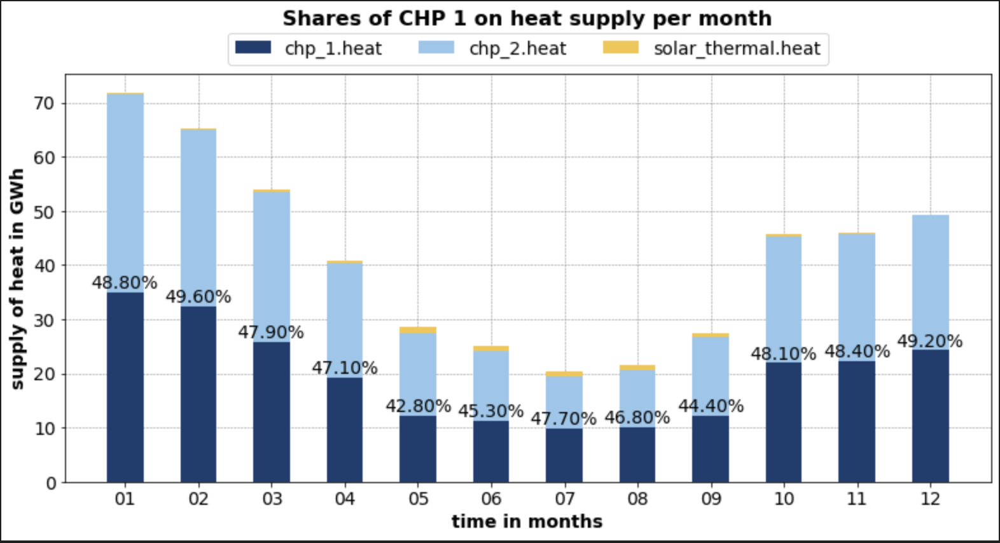
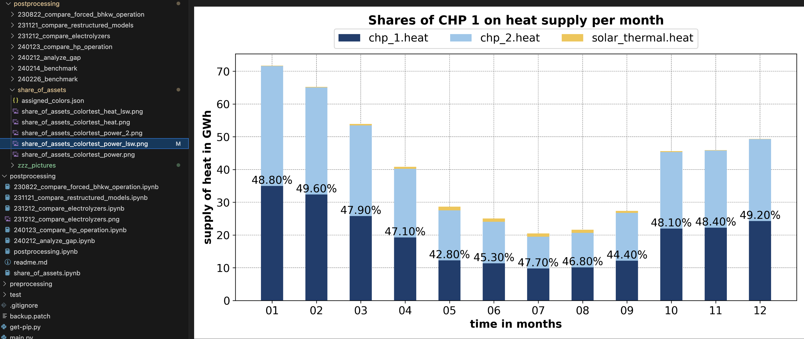

# Burn4H2 Module: Postprocessing
# Table of Contents
- [1 General information](#1-general-information)
- [2 Installation](#2-installation)
- [3 share_of_assets.ipynb](#3-share_of_assets.ipynb)
    - [3.1 What is it for?](#3.1-what-is-it-for?)
    - [3.2 Structure](#3.2-Structure)
    - [3.3 Import of packages](#3.3-Import-of-packages)
    - [3.4 General Helpers](#3.4-General-Helpers)
    - [3.5 Helpers for Colormaps](#3.5-Helpers-for-Colormaps)
    - [3.6 Load data from csv output](#3.6-Load-data-from-csv-output)
    - [3.7 Functions for filtering and calculating values for set time granularity](#3.7-Functions-for-filtering-and-calculating-values-for-set-time-granularity)
    - [3.8 Functions for setting assets and parameters to be visualized](#3.8-Functions-for-setting-assets-and-parameters-to-be-visualized)
    - [3.9 Functions for plotting and saving bar chart for share of assets](#3.9-Functions-for-plotting-and-saving-bar-chart-for-share-of-assets)
    - [3.10 Functions for plotting additionally storage values](#Functions-for-plotting-additionally-storage-values)
    - [3.11 Main Script](#3.11-Main-Script)
- [4 clean_spark_spread.ipynb](#4-clean_spark_spread.ipynb)  
    - [4.1 What is it for?](#4.1-What-is-it-for?)
    - [4.2 Structure](#4.2-Structure)
    - [4.3 Import of packages](#4.3-Import-of-packages)  
    - [4.4 General Helpers](#4.4-General-Helpers)
    - [4.5 Load data from csv output](#4.5-Load-data-from-csv-output)
    - [4.6 Functions for filtering and extracting values](#4.6-Functions-for-filtering-and-extracting-values)  
    - [4.7 Calculate CSS](#4.7-Calculate-CSS)
    - [4.8 Plot economic data](#4.8-Plot-economic-data)
    - [4.9 Main Script](#4.9-Main-Script)


## 1 General information: 
Postprocessing is a folder with scripts that process data from folder output. 
It is coded in jupyter notebook. Typically it generates diagrams and plots for visualization results of linear optimization. 
The following document explains the structure, script functions and what users need to know and keep in mind to use the script. 
Detailed input and output information are documented in docstrings of functions. 

## 2 Installation
Apart from standard installations like a python interpreter and jupyter notebook please check in each script the section "Import of packages" for list of necessary libraries. 

## 3 share_of_assets.ipynb
### 3.1 What is it for?
This script processes data from output_time_series.csv. 
Focus lies on generating stacked box plots, that show supply of different assets for a given time period (f. e. in summer) and granularity (weeks, months etc.). It is possible to add a tag in plot that shows the percentage of an asset or a group of assets on total supply.

### 3.2 Structure
- Import of packages
- General Helpers
- Helpers for Colormaps
- Load data from csv output
- Functions for filtering and calculating values for set time granularity
- Functions for setting assets and parameters to be visualized
- Functions for plotting and saving bar chart for share of assets
- Main Script

### 3.3 Import of packages
Code needs to be executed to load necessary libraries:
- pandas
- numpy
- matplotlib.pyplot 
- Normalize, ListedColormap, LinearSegmentedColormap
- colorcet
- os
- datetime
- json
- Image

#### Code Example:
````python
import pandas as pd
import numpy as np
import matplotlib.pyplot as plt 
from matplotlib.colors import ListedColormap, LinearSegmentedColormap
import colorcet as cc
import os
from datetime import datetime
import json
from PIL import Image
````

### 3.4 General Helpers
**functions**: 
- print_df
- change_energy_units
- get_weeks_from_timestamp
- get_months_from_timestamp

General Helpers can be used all the time and may be **outsourced soon into a separate file** for easy access from anywhere in postprocessing.

**print_df**:  
Function helps printing DataFrames in an appropriate format for console output. It's usable for any DataFrame.

#### Output example:


**change_energy_units**:  
If you input a list and the actual and target unit you want the data to appear you get a list as a return value with adjusted values in your target unit. It is at the moment just usable for: MWh, GWh, kWh and MW, GW, kW. Other units need to be added. If another unit is given you get a key error message, that the given unit is not fitting function. Values in lists are usually of type float. 

#### Output example:


**get_weeks_from_timestamp**:  
If a list of timestamps with start and enddates of weeks is given with the format "['YYYY-MM-DD/YYYY-MM-DD', ...]" the function takes the start date of the week and looks for fitting KW for plotting. It gives back the list with KWs. # Sagen, wieso die Werte so kommen und woher.

#### Output example:


**get_months_from_timestamp**:  
If a list of timestamps with months in this format is given ['YYYY-MM', ...], the function cuts of the string of the year, so just the month-date is left. The list of months is given back as return value. # Sagen, wieso die Werte so kommen und woher.

#### Output example:


### 3.5 Helpers for Colormaps
**functions**:
- register_colormap
- shift_colormap
- darken_colormap
- get_color_for_key
- load_color_data_from_json
- save_colors_for_key_json
- show_color_rgba

In this section general functions for showing, adjusting, loading and saving colors and colormaps of plots are explained.

**register_colormap**:  
Sometimes colormaps are from another library or created by ourselves, so they are not listed in matplotlib. In this case they need to be registered if we want to process them as usual with plt commands. Therefore the function registers colormaps in plt from another library called "colorcet". Other libraries are at the moment not included. The function checks if the colorcet is registered in plt. If not it loads it from plt or registers it for cc. Afterwards the colormap can be used as any other plt colormap by name.

**shift_colormap**:  
Sometimes just special parts of a colormap are interesting for visualization. Especially black and white are colors that are not always requested. Therefore this function allows to shift the color spectrum to parts that are interesting. To shift a colormap we need to set a start and end parameter. Parameters need to be set between 0 and 1. Default values are start: 0 and end: 1. See the example below: 

#### Code example:
```python
import numpy as np
import matplotlib.pyplot as plt
import matplotlib.colors as mcolors
from matplotlib.colors import LinearSegmentedColormap

def register_colormap(cmap_name: str):
    """load colormap from plt and register in plt if colormap from cc.

    Args:
        cmap_name (str): colormap name as string registered in plt or cc.

    Returns:
       LinearSegmentedColormap : loaded colormap from plt.
    """
    if cmap_name not in plt.colormaps():
        colormap = cc.cm[cmap_name]  # load colormap from colorcet
        plt.register_cmap(name=cmap_name, cmap=ListedColormap(colormap(np.linspace(0, 1, 256))))  # only if not available register colormap
    else:
        colormap = plt.get_cmap(cmap_name) # if already registered in matplotlib load map from there.
    return colormap

def shift_colormap(cmap_name: str, start=0.0, end=1.0, amount_colors=256):
    """
    Returns a new colormap that contains a partial area of the original colormap.
    """
    colormap = register_colormap(cmap_name)
    return LinearSegmentedColormap.from_list(
        f"{cmap_name}_adjusted", colormap(np.linspace(start, end, amount_colors))
    )

# Define input data
cmap_name = "viridis"
start, end = 0.2, 0.8  # Shift colormap to focus on a subset
amount_colors = 256

# Generate original and modified colormaps
original_cmap = register_colormap(cmap_name)
modified_cmap = shift_colormap(cmap_name, start, end, amount_colors)

# Generate sample data for visualization
data = np.linspace(0, 1, 100).reshape(10, 10)

# Plot original and shifted colormaps
fig, axes = plt.subplots(1, 2, figsize=(10, 4))

# Original colormap
cbar_original = axes[0].imshow(data, cmap=original_cmap)
axes[0].set_title(f"Original {cmap_name} Colormap")
fig.colorbar(cbar_original, ax=axes[0])

# Shifted colormap
cbar_modified = axes[1].imshow(data, cmap=modified_cmap)
axes[1].set_title(f"Shifted {cmap_name} Colormap ({start} to {end})")
fig.colorbar(cbar_modified, ax=axes[1])

plt.show()
```

#### Output example:


**important: This function is not used in main due to other color demands!**

**darken_colormap**:  
Sometimes it can make sense to show references between different plots or you just want to make colors from a suiting colormap brighter oder darker. In this case it can be an idea to use same colormaps but change the brightness of these colors. In this case this function is designed to darken a given colormap. See the example below: 

#### Code example:
```python
def register_colormap(cmap_name: str):
    """load colormap from plt and register in plt if colormap from cc.

    Args:
        cmap_name (str): colormap name as string registered in plt or cc.

    Returns:
       LinearSegmentedColormap : loaded colormap from plt.
    """
    if cmap_name not in plt.colormaps():
        colormap = cc.cm[cmap_name]  # load colormap from colorcet
        plt.register_cmap(name=cmap_name, cmap=ListedColormap(colormap(np.linspace(0, 1, 256))))  # only if not available register colormap
    else:
        colormap = plt.get_cmap(cmap_name) # if already registered in matplotlib load map from there.
    return colormap

def darken_colormap(cmap_name: str, factor: float, spectrum_left=0.0, spectrum_right=1.0, amount_colors=256):
    """
    Darkens the color map by scaling the RGB values.
    """
    colormap = register_colormap(cmap_name)
    colors = colormap(np.linspace(spectrum_left, spectrum_right, amount_colors))  # Create a list of colors
    darkened_colors = colors.copy()  # Create a copy of the colors
    darkened_colors[:, :3] *= factor  # Only scale RGB values, alpha remains the same
    return LinearSegmentedColormap.from_list(f"{cmap_name}_darkened", darkened_colors)

# Define input data
cmap_name = "viridis"
factor = 0.5  # Darken by 50%
spectrum_left, spectrum_right = 0.0, 1.0
amount_colors = 256

# Generate original and modified colormaps
original_cmap = register_colormap(cmap_name)
darkened_cmap = darken_colormap(cmap_name, factor, spectrum_left, spectrum_right, amount_colors)

# Generate sample data for visualization
data = np.linspace(0, 1, 100).reshape(10, 10)

# Plot original and darkened colormaps
fig, axes = plt.subplots(1, 2, figsize=(10, 4))

# Original colormap
cbar_original = axes[0].imshow(data, cmap=original_cmap)
axes[0].set_title(f"Original {cmap_name} Colormap")
fig.colorbar(cbar_original, ax=axes[0])

# Darkened colormap
cbar_darkened = axes[1].imshow(data, cmap=darkened_cmap)
axes[1].set_title(f"Darkened {cmap_name} Colormap (Factor: {factor})")
fig.colorbar(cbar_darkened, ax=axes[1])

plt.show()
```

#### Output example:


**important: This function is not used in main due to other color demands!**

**get_color_for_key**:  
Sometimes it's senseful to link a color to a key (in this case asset). Colors are saved in assigend_colors_dict and can be saved in a json file to garantuee a color assignment over several executings of the script (function: save_colors_for_key_json). In this function a colormap and belonging parameters are given and as well as an asset name as a string. We want to give this asset a color and skip with the next asset to the next color and assign it. Look at the example below:  

#### Code example:
````python
def get_color_for_key(
    asset_name: str, 
    cmap_name:str, 
    assigned_colors:dict,
    spectrum_left = 0.0,
    spectrum_right = 1.0,
    amount_colors = 256
    ):
    """Assign colors for assets and save in dictionary with assigned_colors.

    Args:
        asset_name (str): String of asset name.
        cmap_name (str): colormap from which assets get colors assigned to
        assigned_colors (dict): existing color dictionary (can also be empty at the beginning)
        spectrum_left(float): starting point of colormap (0.0 = left, 1.0 = right). Defaults to 0.
        spectrum_right (float): end point of colormap (0.0 = left, 1.0 = right). Defaults to 1.
        amount_colors (int): Amounts of colors extracted from map. Defaults to 256.

    Returns:
        tuple: color tuple for one asset with color values in rgba data (values between 0 and 1).
    """
    colormap = register_colormap(cmap_name=cmap_name)
    colors = colormap(np.linspace(spectrum_left, spectrum_right, amount_colors))
    asset_name_split = asset_name.split(".")[0]
    if asset_name_split not in assigned_colors:
        # If key does not have a color, give it the next one: 
        next_color = len(assigned_colors) % len(colors)  # cyclic iterating through colormap
        assigned_colors[asset_name_split] = colors[next_color]
        print(f"neue farbe für: {asset_name_split}:", colors[next_color])
    return tuple(assigned_colors[asset_name_split])

# Define test data
cmap_name = "tab10"
assets = ["solar_panel", "wind_turbine", "battery_storage", "hydro_power", "geothermal"]
assigned_colors = {}

# Assign colors by calling the function multiple times with unique indices
for i, asset in enumerate(assets):
    get_color_for_key(asset, cmap_name, assigned_colors, spectrum_left=i/len(assets), spectrum_right=(i+1)/len(assets))

# Plot assigned colors
fig, ax = plt.subplots(figsize=(6, 3))
for i, (asset, color) in enumerate(assigned_colors.items()):
    ax.barh(i, 1, color=color)
ax.set_title("Assigned Colors for Assets")
ax.set_xticks([])
ax.set_yticks(range(len(assigned_colors)))
ax.set_yticklabels(assigned_colors.keys())
plt.show()
````
#### Output example:


**load_color_data_from_json**:  
For postprocessing it can be helpful if recurring assets retain a color for more than one execution of script f. e. if more than one diagram is generated with different input variables. In this case it makes sense to save colordata in a json file and load it every time the script is executed. This function is for loading a json file into a dictionary with the key of an asset and their colordata in rgba format. See the example below:

#### Code example:
````python
def load_color_data_from_json(
    colors_file: str, 
    output_path: str
    ):
    """
    Loads color values for assets from a JSON file. If the file does not exist
    or is invalid, an empty dictionary is returned.

    Args:
        colors_file (str): name of JSON-file.
        output_path (str): path of saving output file.

    Returns:
        Tuple[dict, str]: Dictionary with the color assignments and file path.
    """
    input_file = os.path.join(output_path, colors_file)
    
    if os.path.exists(input_file):
        try:
            with open(input_file, "r") as file:
                assigned_colors = json.load(file)
            
            # Convert lists back into tuples
            assigned_colors = {key: tuple(value) for key, value in assigned_colors.items()}
        except (json.JSONDecodeError, ValueError):  # Intercept errors during loading
            print(f"Warnung: {input_file} ist beschädigt oder ungültig. Erstelle ein leeres Dictionary.")
            assigned_colors = {}
    else:
        print(f"Datei {input_file} existiert nicht. Erstelle ein neues Dictionary.")
        assigned_colors = {}

    return assigned_colors, input_file

# Example execution
OUTPUT_PATH = '../data/postprocessing/share_of_assets'
COLORS_FILE = 'assigned_colors.json'

# Load color data
assigned_colors, file_path = load_color_data_from_json(COLORS_FILE, OUTPUT_PATH)

# Print results
print("Geladene Farben:", assigned_colors)
print("Pfad zur Datei:", file_path)
````

#### Output example:


**save_colors_for_key_json**:  
To keep colors for known and already displayed assets their color data needs to be saved to load it for next execution of script. If a new color for an asset was set during execution because the asset was not considered before, this colordata is going to be added to origin json file. Therefore this file just gets added and never delets any entries. Once set data for assets are fixed. If a color of a special asset is supposed to be changed the file needs to be deleted or manually edited.

#### Code example: 
- Color dict is loaded in function: "load_color_data_from_json" (see above)
- Color dict is added with new color if new asset is not considered in color dict in function: "get_color_for_key" with this line:  
````python
if asset_name_split not in assigned_colors:
        # If key does not have a color, give it the next one: 
        next_color = len(assigned_colors) % len(colors)  # cyclic iterating through colormap
        assigned_colors[asset_name_split] = colors[next_color]
````
This function gives back the dictionary in main, so it can be saved with updated values in json-file with the following function "save_colors_for_key_json":  
````python
def save_colors_for_key_json(
    colors_file: str, 
    assigned_colors: dict
    ):
    """
    Saves the dictionary with the color assignments in a JSON file.

    Args:
        colors_file (str): path of JSON-file.
        assigned_colors (dict): Dictionary with color assignments.
    """
    # convert NumPy-Arrays in lists
    serializable_colors = {key: value.tolist() if isinstance(value, np.ndarray) else value
                           for key, value in assigned_colors.items()}
    
    # save JSON file
    with open(colors_file, "w") as file:
        json.dump(serializable_colors, file, indent=4)
        
    print(f"JSON file saved as: {colors_file}")

# executed function in main:
save_colors_for_key_json(
    colors_file=color_file_json, 
    assigned_colors=colors_dict
    )
````
#### Output example:  
As an output we get a note, that the file is updated and saved in a given path:


**show_color_rgba**:  
If you assign a special color to an asset or just want to know which color an asset has got you can visualize the color with the function "show_color_rgba". It works for the colorformat rgba in a tuple with floats between 0 and 1. A popup window appears with the color you wanted to visualize. See the example below: 

#### Code example: 
````python 
def show_color_rgba(
    rgba_values:tuple
    ):
    """Show a color in form of rgba with values between 0 and 1.

    Args:
        rgba_values (tuple): 4 values of rgba between 0 and 1.
    """
    rgba_color_255 = tuple(int(color * 255) for color in rgba_values)
    image = Image.new("RGBA", (100, 100), rgba_color_255)
    image.show()

# Example execution
example_rgba = (0.2, 0.6, 0.8, 1.0)  # A blueish color
show_color_rgba(example_rgba)
````
#### Output example:  


### 3.6 Load data from csv output:  
All postprocessing scripts refer to results from optimization model. Mostly, as in this case, they refer to the file output_time_series.csv. In this case the function loads data from csv to a processable df, that's easy to read. See example below: 

#### Code example: 
````python
# 0.3 Load DataFrame of CSV as input-data: 
def load_csv_results_in_df(
    input_path: str
    ):
    """Load output csv in dataframe.

    Args:
        input_path (str): path from which csv is loaded. 

    Returns:
        pd.DataFrame: csv data in dataframe as table type.
    """
    
    input_values_df = pd.read_csv(input_path, index_col=0)
    print_df(input_values_df)
    
    return input_values_df

# Example execution:
INPUT_PATH = "../data/output/output_time_series.csv"
df = load_csv_results_in_df(input_path=INPUT_PATH)
````

#### Output example: 


### 3.7 Functions for filtering and calculating values for set time granularity

**functions**:  
- add_timestamp_and_filter
- sums_by_granularity
- Wrapper: calculate_sums_for_period

In this section input data from result csv is connected, filtered and summed up for time values. It is necessary to show box plots for a specific period.

**add_timestamp_and_filter**:  
All data from output_time_series.csv is given hourly for 1 year (366 days), which ends up in 8784 values. These values are not linked to datetime. In this function data is linked to datetime like "YYYY-MM-DD hh:mm:ss" and inserted into df in column 0 to get a link to time. See the example below:

#### Code example: 
````python
def add_timestamp_and_filter(
    input_df = pd.DataFrame, 
    start_date = str, 
    end_date = str, 
    time_column = 'date'
    ):
    """Insert Dates (YYYY-MM-DD) in DataFrame and filter after given start and end date.
    Assumption: 8784 values (366 days) beginning at 01.01.2025. If necessary needs to be 
    flexibilized.

    Args:
        df (pd.DataFrame, optional): Input Dataframe from results. Defaults to pd.DataFrame.
        start_date (str, optional): first date for filtering. Defaults to str.
        end_date (str, optional): end date for filtering. Defaults to str.
        time_column (str, optional): name of column with time steps. Default value 'date'.

    Returns:
        pd.DataFrame: added colomn with dates and filtered Dataframe after time span.
    """
    # Create List of dates and hours belonging to timestep:
    dates = list(pd.date_range('2025-01-01', periods=8784, freq='H'))
    input_df.insert(0, time_column, dates, allow_duplicates=False)
    input_df[time_column] = pd.to_datetime(input_df[time_column])
    
    # Delete blank spaces of colomn names:
    input_df.columns = input_df.columns.str.replace(' ', '')
    print("Inserted date columns: /n", print_df(input_df))
    # filtered df after time span:
    return input_df[(input_df[time_column] >= pd.Timestamp(start_date)) & (input_df[time_column] <= pd.Timestamp(end_date))]

# Example execution
INPUT_PATH = "../data/output/output_time_series.csv"
df = load_csv_results_in_df(input_path=INPUT_PATH)
START_DATE = "2025-06-01"
END_DATE = "2025-06-10"
filtered_df = add_timestamp_and_filter(df, START_DATE, END_DATE)
print_df(filtered_df)
````

#### Output example: 
In first step dataframe is added by time with the date from 01.01.2025 per hour. 


Secondly data is filtered by the time range we're interested in plotting, in this case from 01.06. until 10.06. 


**sums_by_granularity**:  
After filtering for time we don't want data process hourly data for plots only. In this function we set a time granularity like days, weeks, months or years. In the function all columns from heat_demand are summed up for given time granularity (excluding fixed prices per unit). See example below:

*Note: It should be noted that some values does not make sense if they are summed up like "battery_storage.power_content" because contents don't sum up by time but are more like snap shots! If these columns are processed another function is needed to show this data.*

#### Code example: 
````python
def sums_by_granularity(
    input_df: pd.DataFrame, 
    granularity: str, 
    time_column = 'date',
    period_column = 'period'
    ):
    """group lines of dataframe to given granularity (years, months etc.) and 
    sum up values of columns beginning from second column.

    Args:
        input_df (pd.DataFrame, optional): Dataframe with existing time_column. Defaults to pd.DataFrame.
        granularity (str, optional): time granularity: hours, days, weeks, month, years. Defaults to str.
        time_column (str, optional): Name of column with time data. Default value 'date'.
        period_column (str, optional): Name of column with set period (month, weeks ...). Default value 'period'.

    Raises:
        ValueError: if another granularity is given than defined no groups can 
        be formed.

    Returns:
        pd.DataFrame: filtered DataFrame with relevant time span and granularity. Sums are calculated for time spans. 
    """
    
    df = input_df.copy()
    df[time_column] = pd.to_datetime(df[time_column])
    if granularity == 'month':
        df[period_column] = df[time_column].dt.to_period('M')
    elif granularity == 'year':
        df[period_column] = df[time_column].dt.to_period('Y')
    elif granularity == 'week':
        df[period_column] = df[time_column].dt.to_period('W')
    elif granularity == 'day':
        df[period_column] = df[time_column].dt.to_period('D')
    elif granularity == 'hour':
        df[period_column] = df[time_column].dt.to_period('H')
    else:
        raise ValueError("Invalid time granularity.")
    
    # calculate the totals from the 2nd column, index period is reset and round to 2 digits.
    time_sums_df = df.groupby(period_column).sum().iloc[:, 2:].reset_index().round(2) 
    time_sums_df[period_column] = time_sums_df[period_column].astype(str)  # convert periods to string format
    
    return time_sums_df

# get dataframe to process time granularity in: 
INPUT_PATH = "../data/output/output_time_series.csv"
df = load_csv_results_in_df(input_path=INPUT_PATH)
filtered_df = add_timestamp_and_filter(input_df=df, start_date="2025-01-01", end_date="2025-06-01")

# example execution: 
granularity = "month"
result_df = sums_by_granularity(input_df=filtered_df, granularity=granularity)
print_df(result_df)
````

#### Output example:


**Wrapper: calculate_sums_for_period**:  
Because we don't always need all interim results the wrapper function "calculate_sums_for_period" executes both functions "add_timestamp_and_filter" and "sums_by_granularity" and slims our main function. Therefore outputs and inputs are the same, see below: 

#### Code example: 
````python
def calculate_sums_for_period(
    input_df: pd.DataFrame, 
    start_date: str, 
    end_date: str, 
    granularity: str, 
    time_column='date',
    period_column='period'
    ):
    """Wrapper function: add and filter time values and sum up all values for time span and set granularity.

    Args:
        input_df (pd.DataFrame): Input Dataframe with all data from csv "output_time_series.csv"
        start_date (str): Start date for visualization. Format: 'YYYY-MM-DD'
        end_date (str): end date for visualization. Format: 'YYYY-MM-DD'
        granularity (str): granularity of time: "hours", "days", "weeks", "months", "years".
        time_column (str, optional): name of column with time data. Defaults to 'date'.
        period_column (str, optional): name of column with set period. Defaults to 'period'.

    Returns:
        pd.DataFrame: filtered dataframe after time and granularity and summed up data. 
    """
    time_filtered_df = add_timestamp_and_filter(
        input_df=input_df, 
        start_date=start_date, 
        end_date=end_date, 
        time_column=time_column
        )
    
    return sums_by_granularity(
        input_df=time_filtered_df, 
        granularity=granularity, 
        time_column=time_column, 
        period_column=period_column
        )

# example execution: 
INPUT_PATH = "../data/output/output_time_series.csv"
df = load_csv_results_in_df(input_path=INPUT_PATH)
result_df = calculate_sums_for_period(input_df=df, start_date="2025-01-01", end_date="2025-06-01", granularity="month")
print_df(result_df)
````

#### Output example: 


### 3.8 Functions for setting assets and parameters to be visualized
**functions**: 
- extract_assets_to_dict
- calculate_asset_share_of_supply
- get_periods_for_plot
- Wrapper: get_asset_data_for_plot

In this section we prepare our data for plotting especially summed up supply values. We're connecting our assets to a specific variable we're interested in, we can calculate a specific share of assets on a f.e. total supply and prepare our periods from section 1 for our plot.

**extract_assets_to_dict**:  
To show data from assets we're interested in, we need to extract all assets and their summed up energy value for the type of energy we want to plot. The following function links our set keys with variables from our filtered dataframe which bases on our output_time_series_csv. Therefore we need to define strings of assets and type_of_energy correctly based on those definitions in csv data columns. The function sets up a dictionary with our variables as keys and a belonging list of values for our set time span and granularity. See example below: 

#### Code example: 
````python
def extract_assets_to_dict(
    time_series_df: pd.DataFrame, 
    assets: tuple, 
    type_of_energy: str
    ):
    """
    Reads certain columns associated with all relevant assets for the diagram from a DataFrame 
    and saves them in a dictionary.

    Parameters:
        time_series_df (pd.DataFrame): DataFrame, with all asset data summed up for certain granularity and time span.
        assets (tuple): A tuple with all assets that are to be displayed.
        type_of_energy (str): The type of energy that is relevant and can be read out with the assets.

    Returns:
        dict: A dictionary with the column names of the assets and the energy type according to the format 
        '{asset}.{type_of_energy}' as keys and the column values as an associated list.
    """
    # Generate the complete column names
    column_names = [f"{asset}.{type_of_energy}" for asset in assets]

    # Filter the desired columns:
    extracted_columns_dict = {col: list(time_series_df[col]) for col in column_names if col in time_series_df.columns}
    
    return extracted_columns_dict

time_sums_df = calculate_sums_for_period(
    input_df=load_csv_results_in_df(input_path = INPUT_PATH), 
    start_date = "2025-01-01", 
    end_date = "2025-06-01", 
    granularity="month"
    )
all_considered_assets = ('solar_thermal', 'chp_1', 'chp_2',)

assets_dict = extract_assets_to_dict(time_series_df=time_sums_df, assets=all_considered_assets , type_of_energy= "heat")
print("Extracted asset data from df:  ", assets_dict)
````

#### Output example: 


**calculate_asset_share_of_supply**:  
Sometimes it can make sense to show a share as a number of a group of assets in out plot (f. e. for District Heating, RES etc.). In this function we define in which share of assets we're interested in and calculate the total supply, supply of our group of assets and the percentage our group supplies to total supply. These values are plotted on our bars later on and based on our time span and granularity. See the example below:  

*Note: The order of assets in input tuple is exactly the order of the stacked bars in plot. The text label for share of supply is set on bar of last named asset.
If colors are assigned to assets for the first time (because no json exists) via "get_color_for_key" and a colormap the assignment follow the order of the tuple "all_considered_assets"!*

#### Code example: 
````python
def calculate_asset_share_of_supply(
    asset_dict: dict,
    selected_assets: tuple,
    type_of_energy: str
    ):
    """Calculates the share of selected assets in the total supply of all specified assets. 

    Args:
        asset_dict (dict): all asset keys and their supply.
        selected_assets (tpl): selected assets for showing their share of total supply.
        type_of_energy: (str): type of energy (heat, power etc.)
        
    Returns:
        dict: New dict. The keys for the total demand per period have been added: 
        total_supply.{type_of_energy}, corresponding shares of selected assets with key 'share_of_assets' in percent and 
        selected_assets_supply.{type_of_energy} in actual unit.
        
    """
    supply_share_dict = {}
    # set keys: 
    share_key = "share_of_assets"
    total_supply_key = f"total_supply.{type_of_energy}"
    selected_supply_key = f"selected_assets_supply.{type_of_energy}"
    
    # Sum the values of the individual lists one after the other
    total_values = [sum(values) for values in zip(*asset_dict.values())]
    supply_share_dict[total_supply_key] = total_values
    # Check whether the selected assets (keys) are contained in the dict, 
    # add up their values and save them in the Dict.
    selected_values = [0] * len(total_values)

    # if assetname is in key sum up supply values and save in list.
    for key in asset_dict.keys():
        for asset in selected_assets:
            if asset in key:
                selected_values = [sum(values) for values in zip(selected_values, asset_dict[key])]
    
    # save supply for selected assets
    supply_share_dict[selected_supply_key] = selected_values
    
    # Determine the share of the supply of assets in the total value in percent. 
    share_values = [round((selected / total * 100),1) if total != 0 else 0 
                        for selected, total in zip(selected_values, total_values)]
    
    # save share of selected assets on total supply in dict.
    supply_share_dict[share_key] = share_values
    print("Shares of assets on supply: ", supply_share_dict)
    return supply_share_dict

time_sums_df = calculate_sums_for_period(
    input_df=load_csv_results_in_df(input_path = INPUT_PATH), 
    start_date = "2025-01-01", 
    end_date = "2025-06-01", 
    granularity="month"
    )
all_considered_assets = ('solar_thermal', 'chp_1', 'chp_2',)
my_selected_assets = ('chp_1',)

assets_dict = extract_assets_to_dict(time_series_df=time_sums_df, assets=all_considered_assets , type_of_energy= "heat")
print("Extracted asset data from df:  ", assets_dict)
share_dict = calculate_asset_share_of_supply(asset_dict=assets_dict, selected_assets=my_selected_assets, type_of_energy='heat')
print("Total supply, supply of my asset in MWh and share of my asset on total supply in %: ") 
for key, values in share_dict.items():
    print(f"{key}: {values}")
````

#### Output example:  


**get_periods_for_plot**:  
Our periods are still saved in our overall dataframe time_series and in a format we don't want to plot (f. e. months: 'YYYY-MM'). Therefore we load our data in a list and change the strings in a format we want to plot (f. e. in 'MM'). This list will be used for our x values in our desired plot.

*Note: Strings are just adjusted for granularity 'week', 'month' and 'year'. Functions for cutting strings of 'hour' and 'day' need to be added if necessary.*

#### Code example: 
````python
def get_periods_for_plot(
    time_series_df: pd.DataFrame,  
    granularity: str,
    period_column = 'period'
    ):
    """Add a key with set period and time data to dictionary in a plottable format.

    Args:
        time_series_df (pd.DataFrame): Input Dataframe with filtered values and groups.
        granularity (str): granularity of time: "hours", "days", "weeks", "months", "years".
        period_column (str, optional): name of column with set period. Defaults to 'period'.

    Raises:
        KeyError: period needs to be an column name of DataFrame.

    Returns:
        list: period data for visualization in plot.
    """
    if period_column in time_series_df:
            raw_periods = time_series_df[period_column].tolist()
    else: 
        raise KeyError("period not found in time_series_df.")
    
    if granularity == 'month':
        periods = get_months_from_timestamp(timestamps=raw_periods)
    elif granularity == 'week':
        periods = get_weeks_from_timestamp(timestamps=raw_periods)
    else: periods = raw_periods
    
    return periods

# example code: 
time_sums_df = calculate_sums_for_period(
    input_df=load_csv_results_in_df(input_path = INPUT_PATH), 
    start_date = "2025-01-01", 
    end_date = "2025-06-01", 
    granularity="month"
    )
periods = get_periods_for_plot(
    time_series_df=time_sums_df, 
    granularity='month'
    )
print("Periods / Months we consider: ", periods)
````

#### Output example: 


**get_asset_data_for_plot**:  
This function again acts like a wrapper function to shorten our main script. One additional feature of it is, that inside energy units are changed from actual_unit (default: 'MWh') to target_unit (default: 'GWh'). Other than that, it generates the same results as the functions above, as you can see in the example below: 

#### Code example:
````python
def get_asset_data_for_plot(
    time_series_df: pd.DataFrame,
    all_assets: tuple,
    selected_assets: tuple, 
    type_of_energy: str, 
    granularity: str,
    actual_unit = 'MWh', 
    target_unit = 'GWh'
):
    """Wrapper function: Extract relevant asset data from input to asset_dict as y values for box plot. 
    Generate supply_dict with total supply, supply of selected assets and their share on total supply in percent. 
    Value is labeled in box plot diagram. Extract time periods as values for x axis.

    Args:
        time_series_df (pd.DataFrame): Loaded data from csv. Already filtered and summed up for given start and end date and set time granularity.
        all_assets (tuple): input tuple of all assets that will be considered in plot. 
        selected_assets (tuple): my selected assets for which share of supply is calculated f. e. RES or District Heating.
        type_of_energy (str): Power, heat, CO2 or other type of energy that will be plotted.
        granularity (str): granularity of time: "hours", "days", "weeks", "months", "years".
        actual_unit (str, optional): Unit of input data. Defaults to 'MWh'.
        target_unit (str, optional): Target unit of plotted data. Defaults to 'GWh'.

    Returns:
        asset_dict: Dictionary with relevant asset data like keys and supply in target unit. 
        supply_shares_dict: supplies in actual unit and share in percent of selected assets.
        periods: list of time periods für x axis in box plot.
    """ 
    
    # get keys for all assets and get their supply. Save in dict.
    asset_dict = extract_assets_to_dict(
        time_series_df=time_series_df,
        assets=all_assets,
        type_of_energy=type_of_energy
        )
    print(f"Dict in {actual_unit}:  ", asset_dict)
    
    # Calculated supply from actual unit in target unit and overwrite values: 
    for key in asset_dict.keys():
        asset_dict[key] = change_energy_units(values=asset_dict[key], actual_unit=actual_unit, target_unit=target_unit)
    print(f"Dict in {target_unit}: ", asset_dict) 
    
    return asset_dict, calculate_asset_share_of_supply(asset_dict=asset_dict, selected_assets=selected_assets,type_of_energy=type_of_energy), get_periods_for_plot(time_series_df=time_series_df, granularity=granularity)

time_sums_df = calculate_sums_for_period(
    input_df=load_csv_results_in_df(input_path = INPUT_PATH), 
    start_date = "2025-01-01", 
    end_date = "2025-06-01", 
    granularity="month"
    )
all_considered_assets = ('solar_thermal', 'chp_1', 'chp_2',)
my_selected_assets = ('chp_1',)

asset_dict, share_dict, periods = get_asset_data_for_plot(
    time_series_df=time_sums_df, 
    all_assets=all_considered_assets,
    selected_assets=my_selected_assets,
    type_of_energy='heat',
    granularity='month'
    )

print("Extracted asset data from df: ", asset_dict)
print("Supply and shares of assets: ")
for key, values in share_dict.items():
    print(f"{key}: {values}")
print("Periods / Month we consider: ", periods)
````

#### Output example: 


### 3.09 Functions for plotting and saving bar chart for share of assets
**functions**:  
- plot_shares_of_supply
- save_plot

**plot_shares_of_supply**:  
In this function we finally plot our extracted and defined data as a stacked box plot. We need our asset values, supply_shares, colors, periods, font sizes and other strings for our plot. Here everything of our box plot format is defined and input variables define labels of our title, axis etc. Also our color_dict is updated because the function is called up here for color of bar. We can set a text label with our share in percent if we like when defining key_to_label. If it stays as Default value "None", no label is set. This function gives back a figure from plt if we like to save it in the next step.

*Note: If we don't save the figure and call up "save_plot", we need to turn on "plt.show()" in the function "plot_shares_of_supply", so we can see the result in our output.*


#### Code example: 
````python

def plot_shares_of_supply(
    asset_dict: dict,
    supply_shares_dict: dict,
    assigned_asset_colors:dict,
    colormap:str,
    periods: list,
    granularity: str,
    type_of_energy: str,
    sharename: str,
    fontsize: int,
    title_size: int,
    target_unit: str,
    key_to_label = None
    ):
    """Function for plotting supply of assets as stacked bars. Unit and time granularity is determined, 
    colors are loaded for assets, label is set for share of interested assets like district heating or RES. 
    Return a figure of plt for saving next step.

    Args:
        asset_dict (dict): all asset keys and their supply.
        supply_shares_dict (dict): total_supply, corresponding shares of selected 
        assets with key 'share_of_assets' in percent and selected_assets_supply in 
        actual unit.
        assigned_asset_colors (dict): Dictionary with the color assignments
        colormap (str): Name of colormap
        periods (list): periods set for x axis.
        granularity (str): granularity of time.
        type_of_energy (str): energy type (heat, power etc.)
        sharename (str): name of share to be plotted (RES, District Heating, Solar_thermal etc.)
        fontsize (int): size of font in diagram
        target_unit (str): energy unit (default: GWh),
        title_size (int): size of font from diagram title.
        key_to_label (str, optional): asset names for which share needs to be calculated. If value is None, no label is set on bar. Default to: None. 

    Returns:
        fig: Diagram figure from plt.
    """
    
    # width of plotted bar
    bar_width = 0.5

    # Positions of the time data on the x-axis
    x_pos = np.arange(len(periods))

    # Create plot for Box plot
    fig, ax = plt.subplots(figsize=(11, 6), facecolor="white")

    # Initialization for the offset of the stacked bars
    offsets = np.zeros(len(periods))
    for asset, values in asset_dict.items():
    
    # Get the color for the current asset
        color_asset = get_color_for_key(
            asset_name=asset, 
            assigned_colors=assigned_asset_colors, 
            cmap_name=colormap,
            amount_colors=8
            )
        
        # Draw the bars for the current asset
        bars = ax.bar(
            x_pos,             # positions on x axis
            values,             # values for heigh of bar
            width=bar_width,   # width of bar
            label=asset,       # label of bar
            color=color_asset,     # color of asset
            bottom=offsets,    # Offset for stacked bars
            zorder=2
        )
        
        # Show values directly on boxplot:
        if asset == key_to_label:
            # Show values from 'share_of_assets'
            for j, bar in enumerate(bars):
                ax.text(
                    bar.get_x() + bar.get_width() / 2,  # x position (centered on bar)
                    bar.get_height() + offsets[j],      # y position (above bar)
                    f"{supply_shares_dict['share_of_assets'][j]:.2f}%",  # value of 'share_of_assets'
                    ha='center', va='bottom',  # center text
                    fontsize=fontsize
                    )
        # update offset for next level
        offsets += values
    # axis and labels
    ax.grid(True, color='gray', linestyle='--', linewidth=0.5, zorder=1) 
    ax.set_xlabel(f"time in {granularity}s", fontsize=fontsize, fontweight='bold')
    ax.set_ylabel(f"supply of {type_of_energy} in {target_unit}", fontsize=fontsize, fontweight='bold')
    
    # set title for different amounts of assets (shifting legend height):
    if len(asset_dict) <= 3: 
        y_title = 1.1
    elif 4 <= len(asset_dict) < 7: 
        y_title = 1.2
    elif 7 <= len(asset_dict) < 10: 
        y_title = 1.3
    elif 10 <= len(asset_dict) < 13: 
        y_title = 1.4
    else: 
        raise("too many assets, y title not set. ")
    
    # set labels of plot: 
    ax.set_title(f"Shares of {sharename} on {type_of_energy} supply per {granularity}", fontsize=title_size, fontweight='bold', y=y_title)
    ax.set_xticks(x_pos)
    ax.set_xticklabels(periods)
    ax.tick_params(axis='x', labelsize=fontsize) 
    ax.tick_params(axis='y', labelsize=fontsize)
    ax.legend(
        loc="lower center",           # position of legend
        bbox_to_anchor=(0.5, 1.0),   # anchor point (x=0.5 for central, y=1.0 for above)
        ncol=3,                      # amount of columns in legend
        frameon=True,                # Frame around legend
        fontsize=fontsize,
        title_fontsize=fontsize
        )

    # show diagram
    plt.tight_layout()
    return fig

# 1 Load Data from csv INPUT PATH: 
time_sums_df = calculate_sums_for_period(
    input_df=load_csv_results_in_df(input_path = INPUT_PATH), 
    start_date = start_date, 
    end_date = end_date, 
    granularity=granularity, 
    time_column=time_column
    )

# 2 Process data fitting for box plot visualization: 
asset_plot_dict, supply_shares_dict, periods = get_asset_data_for_plot(
    time_series_df=time_sums_df, 
    all_assets=all_considered_assets,
    selected_assets=my_assets,
    type_of_energy=type_of_energy,
    granularity=granularity,
    actual_unit=actual_unit,
    target_unit=target_unit
)

# 3 load colors from json file: 
colors_dict, color_file_json = load_color_data_from_json(
    colors_file=colors_filename, 
    output_path=OUTPUT_PATH
    )

# 4 plot shares of set assets in input data: 
box_plot_share_chp1 = plot_shares_of_supply(
    asset_dict= asset_plot_dict, 
    supply_shares_dict = supply_shares_dict,
    granularity=granularity,
    type_of_energy=type_of_energy,
    sharename=sharename,
    fontsize=fontsize,
    title_size=title_size,
    key_to_label=key_to_label,
    periods = periods,
    target_unit = target_unit,
    colormap=colormap,
    assigned_asset_colors=colors_dict
    )
````

#### Output example: 


**save_plot**:  
Last but not least our generated plot is given back as a fig variable, that we can save it with a filename in our output_path, that are set as  input variables. 

#### Code example: 
````python
# Copy all data from 1 until 4 before:
box_plot_share_chp1 = plot_shares_of_supply(
    asset_dict= asset_plot_dict, 
    supply_shares_dict = supply_shares_dict,
    granularity=granularity,
    type_of_energy=type_of_energy,
    sharename=sharename,
    fontsize=fontsize,
    title_size=title_size,
    key_to_label=key_to_label,
    periods = periods,
    target_unit = target_unit,
    colormap=colormap,
    assigned_asset_colors=colors_dict
    )

# Definition Pathes, file and folder names for diagram:
filename = 'share_of_assets_colortest_power_lsw.png'
output_folder_name = 'share_of_assets'
OUTPUT_PATH = '../data/postprocessing/' + output_folder_name

# 5 Save figure of plot.
save_plot(
    fig=box_plot_share_RES,
    output_path=OUTPUT_PATH,
    filename=filename 
)
````

#### Output example: 
When our figure is saved, we get a notification with the path, where it was saved. In this folder we find our png-file of our figure.




### 3.10 Functions for plotting additionally storage values
*ergänzen um: get_data_for_storage_plot, plot_shares_and_storage!*

### 3.11 Main Script
**Structure**: 
- Input values
- Main script

**Input values**:  
This is the key section for setting parameters for our plot. And it's normally the only section, where we change values with each execution of our main script. Most important are the inputs: 
- filename
- my_assets
- all_considered_assets
- type_of_energy
- granularity
- start_date
- end_date
- sharename
- key_to_label

See the example below: 

#### Code example: 
````python
# 1 General Definition of variables:
granularity = str 
visualized_assets = list
assets_for_share = list

# 2 Definition Pathes, file and folder names for diagram:
filename = 'share_of_assets_colortest_power_lsw.png'
output_folder_name = 'share_of_assets'
colors_filename = "assigned_colors.json"
INPUT_PATH = '../data/output/output_time_series.csv'
OUTPUT_PATH = '../data/postprocessing/' + output_folder_name

# 3 Input constants for visualization:
my_assets = ('chp_1',) # heat: solar_thermal, arc11_expanded, power: arc01_expanded, pv
all_considered_assets = ('chp_1', 'chp_2', 'solar_thermal',) # heat: 'solar_thermal', 'arc11_expanded', 'arc12_expanded', 'arc16_expanded'
type_of_energy = 'heat'
actual_unit = 'MWh'
target_unit = 'GWh'
granularity = 'month'
time_column = 'date'
start_date = '2025-01-01'
end_date = '2025-12-31'

# 0.4 Texts for visualization:
sharename = 'CHP 1' 
key_to_label = f'chp_1.{type_of_energy}' # if set to "None" - no label in diagram!

# 0.5 other settings for visualization: 
fontsize = 14
title_size = 16
colormap = 'nipy_spectral'
# color_shift_left = 0.2 # 0 normaler linker Rand der colormap
# color_shift_right = 0.9 # 0 normaler rechter Rand der colormap
# darken_factor = 0.7 # wie viel dunkler power ggü heat sein soll
````

**Main script**:  
We always need to update out input values before executing our main script. 
Normally we don't need to change anything in this script, if we want to follow the workflow of generating a plot for shares of different assets on supply and save it later on with defined colors. See the example below: 

*ergänzen um: decide_for_diagram_and_plot!*

#### Code example: 
````python
# 1 Load Data from csv INPUT PATH: 
time_sums_df = calculate_sums_for_period(
    input_df=load_csv_results_in_df(input_path = INPUT_PATH), 
    start_date = start_date, 
    end_date = end_date, 
    granularity=granularity, 
    time_column=time_column
    )

# print_df(time_sums_df)

# 2 Process data fitting for box plot visualization: 
asset_plot_dict, supply_shares_dict, periods = get_asset_data_for_plot(
    time_series_df=time_sums_df, 
    all_assets=all_considered_assets,
    selected_assets=my_assets,
    type_of_energy=type_of_energy,
    granularity=granularity,
    actual_unit=actual_unit,
    target_unit=target_unit
)

# print("asset_plot_dict: ", asset_plot_dict)

# 3 load colors from json file: 
colors_dict, color_file_json = load_color_data_from_json(
    colors_file=colors_filename, 
    output_path=OUTPUT_PATH
    )

# print("colors dict", colors_dict)

# 4 plot shares of set assets in input data: 
box_plot_share_RES = plot_shares_of_supply(
    asset_dict= asset_plot_dict, 
    supply_shares_dict = supply_shares_dict,
    granularity=granularity,
    type_of_energy=type_of_energy,
    sharename=sharename,
    fontsize=fontsize,
    title_size=title_size,
    key_to_label=key_to_label,
    periods = periods,
    target_unit = target_unit,
    colormap=colormap,
    assigned_asset_colors=colors_dict
    )

# 5 save figure of plot in # 4.
save_plot(
    fig=box_plot_share_RES,
    output_path=OUTPUT_PATH,
    filename=filename 
)

# 6 save colors if new asset is added: 
save_colors_for_key_json(
    colors_file=color_file_json, 
    assigned_colors=colors_dict
    )
````

#### Output example: 


## 4 clean_spark_spread.ipynb
### 4.1 What is it for?
This script processes data from output_time_series.csv. 
Focus lies on generating stacked box plots, that show supply of different assets for a given time period (f. e. in summer) and granularity (weeks, months etc.). It is possible to add a tag in plot that shows the percentage of an asset or a group of assets on total supply.

### 4.2 Structure
- Import Packages
- General Helpers
- Load data from csv output
- Functions for filtering and extracting values
- Calculate CSS
- Plot economic data
- Main Script

### 4.3 Import of packages
Needs to be executed to load necessary libraries for following code:
- pandas
- matplotlib.pyplot
- datetime 
- os

#### Code example:
````python 
import pandas as pd
import matplotlib.pyplot as plt
from datetime import datetime
import os
````
### 4.4 General Helpers

### 4.5 Load data from csv output

### 4.6 Functions for filtering and extracting values

### 4.7 Calculate CSS

### 4.8 Plot economic data

### 4.9 Main Script


*written by: Sophia Reker*